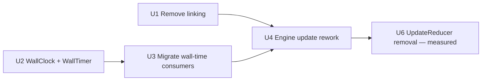

# refactor: Engine spine overhaul — linking removal, update rework, wall-clock service

## Summary

Execute the unblocking spine of the architecture overhaul: remove the unused track-linking subsystem, rework `Engine::update()` so the global recompute runs once per tick with correct ordering (folding in the CV-router-stale stability fix), stand up a shared 32-bit wrap-safe microsecond wall-clock service to replace scattered `os::ticks()` use. (The originally-planned PhaseFlux/Stochastic `tickPosition()` parity, U5, was closed as not-applicable — see U5.) Routing-definition collapse and the recording subsystem are explicitly out of this plan.

---

## Problem Frame

Six subsystem maps under `.tasks/core-architecture-optimization/` established that the engine core is sound but carries per-feature drift: the per-tick update re-runs global recomputes once per firing track (T× redundant) with an ordering that leaves CV-route outputs one update stale; wall-time is read ad-hoc at three call sites against a 32-bit counter; two newer engines re-derive phase from integer ticks instead of the shared interpolated position; and linking is a Note/Curve-era subsystem that six of eight track types can't use and the product owner never uses. The verdict (`.scratch/architecture-current-vs-proposed.html`) was targeted changes, not overhaul — this plan is the spine of those changes.

---

## Requirements

- R1. `Engine::update()` runs the global recompute (routing, overrides, track-output composition) once per tick, not once per firing track.
- R2. Physical CV outputs reflect current-tick routing — CV-route outputs are no longer one update stale (structural resolution of the `stability-fixes` critical item).
- R3. A single 32-bit microsecond wall-clock service (matching the engine's existing `uint32_t` µs convention) replaces the scattered `os::ticks()` behavioral call sites; its timers are drift-free and wrap-safe.
- R4. An external slave clock with jitter/swing produces stable playback timing (period outlier-guarded).
- ~~R5. PhaseFlux and Stochastic derive phase from the shared continuous transport position (`Clock::tickPosition()`) like the other six engines.~~ **Dropped** — neither engine has a continuous phase to repoint (see U5).
- R6. The linking subsystem is removed without breaking existing project files that stored a link assignment.
- R7. No behavior regression in kept subsystems (model, containers, track engines, outputs); STM32 release builds within budget.

---

## Scope Boundaries

- **Routing-definition collapse** — not in this plan. Direction is unresolved (collapse / per-track-ownership / consistency-pass); planning its units now would be speculative.
- **Recording subsystem** — not in this plan (deferred pending a decision on external-MIDI-into-procedural-tracks).
- **MIDI dispatch contract + Clock swing-scope tweaks** — documentation/minor; not this plan.
- **Model, containers, track engines** — KEEP; no rewrites.
- **`feat/tt2-v2-native`** — separate stream; it conforms to the new contracts as it finishes.

### Deferred to Follow-Up Work

- Routing-definition collapse: separate plan once direction is chosen (`.tasks/core-architecture-optimization/routing-five-sources-map.md`).
- Recording scope/generalize decision: separate plan (`recording-map.md`).
- MIDI dispatch contract + Clock swing documentation: separate small pass (`midi-subsystem-map.md`, `clock-subsystem-map.md`).

---

## Context & Research

### Relevant Code and Patterns

- `src/apps/sequencer/engine/Engine.cpp` — `update()` (pass order), `updateTrackOutputs()`, `updateOverrides()`; modulator loop; `os::ticks()` dt at the top of `update()`.
- `src/apps/sequencer/engine/UpdateReducer.h` — the per-track `UpdateReducer<25ms>` rate-limit crutch.
- `src/apps/sequencer/engine/TrackEngine.h` — `TrackLinkData`, virtual `linkData()`, `_linkedTrackEngine`.
- `src/apps/sequencer/engine/NoteTrackEngine.{h,cpp}` and `src/apps/sequencer/engine/CurveTrackEngine.{h,cpp}` — **both produce and both consume** `linkData`: each exposes `linkData()` (NoteTrackEngine.cpp:364-366, CurveTrackEngine.cpp:238-240) and each adopts a source's `linkData` when linked (NoteTrackEngine.cpp:162-171, CurveTrackEngine.cpp:154-166). It's a symmetric Note↔Curve pair, not producer/consumer.
- `src/apps/sequencer/model/Track.{h,cpp}` — `_linkTrack` field; serialized at `Track.cpp` write/read.
- `src/apps/sequencer/ui/pages/LayoutPage.{h,cpp}`, `src/apps/sequencer/ui/model/LinkTrackListModel.h` — the link UI control.
- `src/apps/sequencer/engine/Clock.{h,cpp}` — `tickPosition()`, `slaveTick()` raw period assignment.
- Behavioral `os::ticks()` wall-time consumers (full inventory): `Engine.cpp:72` (modulator `dt`), `MidiOutputEngine.cpp:29` (CC rate-limit), `MidiCvTrackEngine.cpp:113,215` (voice timing), `CvGateToMidiConverter.h:15,31,40,47` (gate-on debounce delay), `TeletypeBridge.cpp:64` (wall-ms feed to Teletype TIME). Seed-only: `RandomGenerator.cpp:60-66` (one-shot RNG seed). Display-only (out of scope): all `os::ticks()` reads under `ui/` plus `Engine.cpp:485` uptime and `FileManager.cpp:1251`.
- `tickPosition()` consumer pattern: `src/apps/sequencer/engine/CurveTrackEngine.cpp` (Free-mode phase), `DiscreteMapTrackEngine.cpp:193` (stateless ramp) — the engines that have a continuous phase already read it.

### Institutional Learnings

- Architecture maps (consolidated research, file:line cited): `engine-update-contention-map.md`, `io-layout-linking-map.md`, `clock-subsystem-map.md`, `midi-subsystem-map.md`, `recording-map.md`, `routing-five-sources-map.md`.
- `docs/plans/2026-05-29-wallclock-time-architecture-design.md` — validated design for the wall-clock service (B) + tickPosition parity (A), ER-101 reference.
- `.tasks/stability-fixes.md` — three crash fixes already landed on `fix/stability` (merged to dev); CV-router ordering is the remaining critical item, resolved structurally by U4.
- Project rule: model layout / serialization changes use forward-compatible encodings, **no `ProjectVersion` bump**.

### External References

- ER-101 (`OTHERS/ortagonal/er-101/wallclock.h`) — `walltimer` drift-free deadline pattern (`end_time += delay`), 64-bit free-running reference, 0.5×–2× slave-period latch.

---

## Key Technical Decisions

- **Remove linking rather than scope or generalize it** — unused; the synced-modulation purpose is now served by global modulators + routing + Curve clock-mult/global-phase. Cheaper and removes a Note/Curve-era subsystem entirely. (`io-layout-linking-map.md`)
- **Reserved-placeholder serialization on linking removal** — keep the `_linkTrack` byte in the wire format as a written-zero / read-discarded reserved field; remove the feature, not the byte. The format is positional, so dropping the write while keeping the read would shift every later field (the adversarial review's no-ship). Old and new files stay byte-aligned, no `ProjectVersion` bump; the byte is reclaimed later at an intentional format break (the `finalize.md` reserved-byte practice).
- **WallClock is 32-bit µs + a wrap-safe `WallTimer` using `end += delay`** — drift-free repeat scheduling via signed-difference comparison (`(int32_t)(now-end) >= 0`). 32-bit matches the engine's existing `uint32_t` µs convention; 64-bit was wrong for a Cortex-M4 (multi-instruction ops + non-atomic read of a software-extended counter). Only ER-101's deadline/drift-free *pattern* transfers, not its 64-bit width (ER-101 counted CPU cycles, ~1 min wrap).
- **Hoist the global passes out of the per-track loop to once-per-tick** — the per-track invocation is T× redundant. Safe because Curve's link consumed `sequenceState`, not composed output (`io-layout-linking-map.md`), and U1 removes linking entirely, clearing the gate outright.
- **Fix loop ordering** — run routing / `updateOverrides` (CV router) before `updateTrackOutputs`, so physical outputs use current-tick routing. This is the structural form of the `stability-fixes` CV-router item.
- **Modulators tick first, before routing** (decided, not deferred) — the once-per-tick order is `modulators → routing → updateOverrides → updateTrackOutputs`, so a modulator used as a routing source reflects the current tick, eliminating the 1-tick source latency. This is the architecturally correct order; no reason to ship the documented-latency fallback.
- **UpdateReducer removal is gated on measurement, split out of U4** — hoisting + ordering (U4) is decided and unconditional. Whether `UpdateReducer<25ms>` can be dropped depends on the measured cost of one full recompute per tick at 192 PPQN on STM32, which has no answer from reasoning alone. U4 keeps the reducer as a safety cap; its removal is a measured follow-up (U6), not an in-U4 judgment call.
- ~~**tickPosition parity is additive**~~ — withdrawn; PhaseFlux/Stochastic have no continuous phase to repoint (see U5, closed not-applicable).

---

## Open Questions

### Resolved During Planning

- Plan scope: spine only (linking, engine rework, wall-clock). Routing + recording out. (user, 2026-05-30)
- tickPosition parity (U5) closed as not-applicable; PhaseFlux sub-tick smoothing deferred to a future per-track tick/wall-clock/update-cadence discussion. (user, 2026-05-31)
- Routing direction: deferred to its own plan. (user, 2026-05-30)
- Recording: out of this plan. (user, 2026-05-30)

### Resolved (pulled forward from implementation after review)

- **Modulator ordering** → modulators tick first, before routing (see Key Technical Decisions). No longer an implementation judgment call.
- **UpdateReducer fate** → split: U4 keeps it as a safety cap; removal is the measured follow-up U6. No longer an in-U4 decision.

### Deferred to Implementation

- **WallTimer API surface** — exact method set (`schedule`/`start`/`elapsed`/`restart`) finalized when wiring the first consumer.

---

## High-Level Technical Design

> *This illustrates the intended approach and is directional guidance for review, not implementation specification. The implementing agent should treat it as context, not code to reproduce.*

Unit dependency graph:



> U5 (PhaseFlux/Stochastic tickPosition parity) was closed as not-applicable — removed from the graph.

`Engine::update()` per-tick shape, before vs after (directional):

```
BEFORE: per-track loop { tick; if CvUpdate&reducer: trackOutputs -> overrides -> routing }   (T× / tick, stale order)
AFTER:  per-track loop { tick }  then once: modulators -> routing -> overrides(CVrouter) -> trackOutputs
```

---

## Implementation Units

### U1. Remove the linking subsystem

**Goal:** Delete track linking end to end — model field UI, engine wiring, the data contract — without breaking existing project files.

**Requirements:** R6, R7

**Dependencies:** None (clears the gate for U4)

**Files:**
- Modify: `src/apps/sequencer/engine/TrackEngine.h` (drop `TrackLinkData`, `linkData()`, `_linkedTrackEngine`, `setLinkedTrackEngine`, ctor param)
- Modify: `src/apps/sequencer/engine/NoteTrackEngine.{h,cpp}` (drop both the `linkData()` producer and the link-adopt branch in `tick()`; Note runs its own clock)
- Modify: `src/apps/sequencer/engine/CurveTrackEngine.{h,cpp}` (drop both the `linkData()` producer and the link-adopt branch in `tick()`; Curve runs its own clock)
- Modify: `src/apps/sequencer/engine/Engine.cpp` (drop `linkedTrackEngine` resolution in track setup; drop ctor arg at each `create<…Engine>`)
- Modify: `src/apps/sequencer/model/Track.{h,cpp}` (drop the public `_linkTrack` API; **keep the field as a reserved byte** — write a zero placeholder, read-and-discard — so the wire format does not move)
- Modify: `src/apps/sequencer/ui/pages/LayoutPage.{h,cpp}`, `src/apps/sequencer/ui/model/LinkTrackListModel.h` (remove the Link control / list model)
- Test: `src/tests/unit/sequencer/TestLinkingRemovalSerialization.cpp`

**Approach:**
- **Reserved-placeholder serialization (corrected after adversarial review).** The project format is positional with no per-field presence markers, so removing the `_linkTrack` *byte* would shift every later field. Instead: keep writing a reserved zero where `_linkTrack` was and keep the read consuming it as a discard. Remove only the *feature* (UI, engine wiring, behavior), not the byte. Old and new files stay byte-aligned; no `ProjectVersion` bump. The byte is reclaimed later at an *intentional* format break, batched with the other known dead fields (stochastic reserved bytes, dead event bits per `stochastic-track-port/finalize.md`). Do **not** stop writing the field while still reading it — that is the misalignment the review flagged.
- Both Note and Curve lose the "adopt source `sequenceState`/divisor" path and revert to running purely from their own sequence/clock — confirm each already has a self-driven path (it does; linking was the override).
- Search for every `linkedTrackEngine` / `linkData` / `linkTrack` reference and remove; the maps confirm the consumer set is small.

**Execution note:** Characterization-first — before deleting, capture a project save with a link set, to assert it still loads identically post-removal (the reserved byte keeps the stream aligned).

**Patterns to follow:** `feedback_no_project_version_bump` (forward-compatible reserved-field encodings); the stochastic reserved-byte precedent in `finalize.md`.

**Test scenarios:**
- Happy path: a track with no link configured behaves identically before/after (Note and Curve each play from their own sequence).
- Edge case: old project with **Note linked to Curve** → loads without error, link inert, Note plays from its own sequence.
- Edge case: old project with **Curve linked to Note** → loads without error, link inert, Curve plays from its own sequence.
- Edge case: old project with a track linked to a **non-`linkData` source** (one of the six types that never produced link data) → loads without error, link inert.
- Edge case: load an old project authored with `linkTrack` set → **every field after the link byte reads correctly** (stream stays aligned because the reserved byte is still consumed).
- Edge case: save → reload a project after removal → round-trips clean; the reserved byte writes zero and reads back as discard, no misalignment.
- Integration: old-with-link fixture, new-without-feature fixture, and save→reload round trip all load and play (the three fixtures the review asked for).
- Verification of build: no dangling references to `linkData`/`linkedTrackEngine` (compile is the check).

**Verification:** sim + STM32 release build clean; the serialization test passes across all three fixtures; an old project with a link loads and plays with the link inert.

---

### U2. WallClock + WallTimer service

**Goal:** Add a 32-bit microsecond free-running clock and a drift-free, wrap-safe timer value type, with no consumers yet.

**Requirements:** R3

**Dependencies:** None

**Files:**
- Create: `src/apps/sequencer/engine/WallClock.h`
- Test: `src/tests/unit/sequencer/TestWallClock.cpp`
- Modify: `src/tests/unit/sequencer/CMakeLists.txt` (register test)

**Approach:**
- **32-bit, not 64-bit (corrected after adversarial review).** The Performer is a 32-bit Cortex-M4; the engine already standardizes on `uint32_t` µs (`Clock::_elapsedUs`, `Engine::_lastSystemTicks`) with wrap-safe delta arithmetic. A 64-bit software-extended counter would cost multi-instruction ops on the hot path and — worse — can't be read atomically on a 32-bit MCU (the two halves tear across the high-word increment). Use `uint32_t`.
- `WallClock::now()` returns `uint32_t` µs derived from the existing time source, matching `_elapsedUs`.
- `WallTimer { uint32_t endUs; bool running; }` with `schedule(deadlineUs)`, `start(clock, delayUs)`, `elapsed(clock)`, `restart(delayUs)` doing `endUs += delayUs`. Comparisons are **wrap-safe**: `elapsed` is `(int32_t)(now - endUs) >= 0`, never `now > endUs`. The drift-free property (accumulate from prior deadline) is independent of bit width.
- All consumers compute short deltas/deadlines, so a 32-bit µs wrap (~71 min) is a non-issue with wrap-safe arithmetic — the same idiom the codebase already uses (`_elapsedUs - _lastSlaveTickUs`).
- Header-only if feasible (no new translation unit); otherwise a thin `.cpp`.

**Execution note:** Test-first — the drift-free `restart` and the wrap-safe comparison are the whole point and are cheap to assert.

**Patterns to follow:** existing `uint32_t` µs + wrap-safe delta in `Clock.cpp`/`Engine.cpp`; the `walltimer` deadline/drift-free *pattern* (not the 64-bit width) from `OTHERS/ortagonal/er-101/wallclock.h`; design doc `docs/plans/2026-05-29-wallclock-time-architecture-design.md`.

**Test scenarios:**
- Happy path: `start(delay)` then advancing the clock past the deadline → `elapsed()` returns true exactly once.
- Edge case: `restart(delay)` accumulates from `endUs` not current time — two restarts across a late service still land on the original cadence (drift-free). Assert deadlines are `base+d`, `base+2d`, not `serviced+d`.
- Edge case: **wrap-safe** — a deadline set just below the `uint32_t` wrap with `now` just past it (wrapped) still reports elapsed correctly via the signed-difference comparison.
- Error path: `elapsed()` on a non-running timer returns false.

**Verification:** all `TestWallClock` cases green on sim release; the wrap-safe case proves correctness across the 32-bit boundary.

---

### U3. Migrate wall-time consumers to WallClock + fold slave-period guard

**Goal:** Replace the behavioral `os::ticks()` sites with the WallClock service, and add the slave-clock period outlier guard.

**Requirements:** R3, R4

**Dependencies:** U2

**Wall-time site classification (every behavioral `os::ticks()` reader):**
- **Migrate:** `Engine.cpp:72` (modulator `dt`), `MidiOutputEngine.cpp:29` (CC rate-limit), `MidiCvTrackEngine.cpp:113,215` (voice timing), `CvGateToMidiConverter.h:15,31,40,47` (gate-on debounce — behavioral delay, migrate to `WallClock`).
- **Migrate (timestamp source):** `TeletypeBridge.cpp:64` feeds wall-ms into Teletype's TIME; swap to `WallClock::now()` scaled to ms so Teletype shares the one clock.
- **Leave (seed-only):** `RandomGenerator.cpp:60-66` uses `os::ticks()` as a one-shot RNG seed — entropy, not timing; no drift concern, out of scope.
- **Leave (display-only):** all `ui/` reads, `Engine.cpp:485` uptime, `FileManager.cpp:1251` — not timing-behavioral.

**Files:**
- Modify: `src/apps/sequencer/engine/Engine.cpp` (modulator `dt` derivation)
- Modify: `src/apps/sequencer/engine/MidiOutputEngine.cpp` (CC rate-limit → `WallTimer` at 50/s)
- Modify: `src/apps/sequencer/engine/MidiCvTrackEngine.cpp` (voice timing)
- Modify: `src/apps/sequencer/engine/CvGateToMidiConverter.h` (gate-on debounce → `WallClock`/`WallTimer`)
- Modify: `src/apps/sequencer/engine/TeletypeBridge.cpp` (TIME source → `WallClock::now()` in ms)
- Modify: `src/apps/sequencer/engine/Clock.{h,cpp}` (slave-period 0.5×–2× outlier latch in `slaveTick()`)
- Test: extend `src/tests/unit/sequencer/` with a slave-period guard test if `Clock` is unit-testable in isolation; otherwise characterization + hardware

**Approach:**
- Modulator `dt` becomes an explicit WallClock delta — makes "modulators run on real time" intentional (resolves the long-flagged dt-vs-transport ambiguity by stating it).
- CC rate-limit uses a `WallTimer`; behavior parity target is the existing ~50/s.
- Slave period: keep the raw measurement but only latch `_slaveTickPeriodUs` when within 0.5×–2× of the running value; the displayed-BPM smoothing already exists and stays. ER-101's minimal guard; the design doc's 4-phase pipeline is an optional later upgrade, not required here.

**Execution note:** Characterization-first on the MIDI/clock paths — capture current CC cadence and slave-lock behavior before swapping the time source.

**Patterns to follow:** `WallTimer` from U2; ER-101 period latch.

**Test scenarios:**
- Happy path (where unit-testable): a steady slave period latches and tracks tempo unchanged.
- Edge case: a single jitter spike >2× the running period is rejected (period unchanged) rather than causing a tempo jump. (R4)
- Edge case: a genuine tempo change held across several ticks (consistently outside the old band) is eventually adopted, not rejected forever.
- Integration: CC output cadence stays ~50/s after the WallTimer swap (characterization comparison).

**Verification:** sim + STM32 build clean; slave-clock holds steady under a swung/jittery external clock on hardware; CC cadence unchanged.

---

### U4. Engine::update rework — single-pass global recompute + ordering fix

**Goal:** Hoist the global recompute out of the per-track loop to once per tick, in the decided order (`modulators → routing → updateOverrides → updateTrackOutputs`), eliminating the T× redundancy and the CV-route stale read. Scope is hoist + ordering only; `UpdateReducer` stays as a safety cap (removal is U6).

**Requirements:** R1, R2, R7

**Dependencies:** U1 (linking gate cleared), U3 (modulator dt source settled)

**Files:**
- Modify: `src/apps/sequencer/engine/Engine.cpp` (`update()` per-tick loop; `updateTrackOutputs()`/`updateOverrides()` call sites)

**Approach:**
- Per tick: run the per-track `tick()` loop with no inner global recompute; then once, after the loop, run `modulators → routing → updateOverrides (CV router) → updateTrackOutputs`.
- Modulators run first so a modulator used as a routing source reflects the current tick (decided — see Key Technical Decisions).
- Ordering: CV router computation before physical-output composition fixes the one-update-stale CV-route (the `stability-fixes` critical item) structurally.
- `UpdateReducer<25ms>` is left in place as a safety cap; do not remove it here (its removal is the measured follow-up U6).
- This is the audio hot path with no automated timing harness; rely on the existing stability unit tests for the components plus hardware audition for timing.

**Execution note:** Characterization-first — capture reference CV/gate output for a known project before the rework; compare after. No automated engine-timing harness exists, so hardware audition is the acceptance gate.

**Patterns to follow:** current `update()` structure (`Engine.cpp`); `engine-update-contention-map.md` (before/after shape, run-count math).

**Test scenarios:**
- Happy path: existing component stability tests (`TestCvRouteLaneGuard`, `TestModulatorAdsrZeroTick`, `TestModulatorReadSanitize`) still pass.
- Integration: a CV route driven from a track output reflects the **current** tick's value, not the previous tick's (CV-route stale resolved) — assert via whatever engine-level harness is reachable; otherwise document as a hardware-audition check.
- Edge case: multiple tracks firing CvUpdate in one tick produce one global recompute, not N (instrument/observe the recompute count if a hook is available; otherwise reason from the code).
- Test expectation: limited automated coverage — engine timing has no unit harness; acceptance is component tests green + hardware audition. (documented, not skipped)

**Verification:** sim + STM32 build clean; component stability tests green; hardware audition shows no timing/modulation regression and CV routes track current-tick.

---

### U5. PhaseFlux and Stochastic onto tickPosition() — NOT APPLICABLE (closed 2026-05-31)

**Status:** Closed without implementation. The premise was wrong: neither engine
is a Curve-style Free-mode engine that re-derives a continuous phase from the
integer tick, so there is nothing to repoint at `tickPosition()`.

Findings (verified against current code):
- **Stochastic** has no phase. `tick()` sets `_cvOutputTarget` from events; `update(dt)`
  slides `_cvOutput` toward it on real time (`StochasticTrackEngine.cpp:748`). It is
  sample-and-hold + slide, already continuous via `update(dt)`. `tickPosition()` does
  not apply.
- **PhaseFlux** generates its whole CV envelope inside `tick()` from an integer-tick
  `_stagePhase` (`PhaseFluxTrackEngine.cpp:637` + the pipeline ~669–728); `update()`
  is a no-op. The output is tick-quantized by construction. Genuine sub-tick smoothing
  would mean *relocating* the envelope pipeline from `tick()` into `update()` driven by
  `tickPosition()` — an architectural rewrite of a CV-curve path, not a phase-source swap.
- The six engines that genuinely have a continuous phase/ramp (Curve, DiscreteMap,
  Tuesday, Indexed, Note-Free, Teletype-Free) already read `tickPosition()` —
  confirmed e.g. `DiscreteMapTrackEngine.cpp:193`.

**Deferred:** sub-tick PhaseFlux envelope smoothing is its own future topic, to be
taken up in a broader discussion of per-track tick-clock vs wall-clock vs update
cadence — not part of this spine plan.

---

### U6. UpdateReducer removal — measured follow-up to U4

**Goal:** Determine whether the once-per-tick global recompute (post-U4) is cheap enough to drop `UpdateReducer<25ms>` entirely, and remove it if so.

**Requirements:** R1 (completes the redundancy removal), R7

**Dependencies:** U4 (must run on the hoisted single-pass shape)

**Files:**
- Measure first: `src/apps/sequencer/engine/Engine.cpp` (`update()` per-tick recompute cost on STM32 release at 192 PPQN, worst case = all 8 tracks firing CvUpdate in one tick).
- Modify (if measurement clears it): `src/apps/sequencer/engine/UpdateReducer.h` (remove), `src/apps/sequencer/engine/Engine.cpp` (drop the reducer gate).

**Approach:**
- This is a measurement-gated decision, not a design choice. With the recompute hoisted to once per tick (U4), the T× amplification the reducer was guarding against is gone; the only open question is the absolute per-tick cost on hardware.
- If the measured worst-case per-tick recompute fits the tick budget with margin, remove the reducer. If not, keep it as the cap and document the measured headroom.

**Execution note:** STM32-only — the cost question is meaningless on sim. Instrument the recompute on hardware before touching `UpdateReducer.h`.

**Test scenarios:**
- Happy path: with the reducer removed, all component stability tests still pass and hardware audition shows no timing regression at 192 PPQN with all tracks active.
- Test expectation: acceptance is a hardware timing measurement + audition, not a unit assertion (no engine-timing harness). (documented, not skipped)

**Verification:** STM32 release within tick budget under worst-case load; if removed, no timing regression on hardware audition.

---

## System-Wide Impact

- **Hot path:** U4 touches `Engine::update()`, which every track engine ticks through. Highest regression risk; gated by hardware audition.
- **Serialization:** U1 removes the linking *feature* but keeps the `_linkTrack` byte in the wire format — written as a reserved zero, read-and-discarded — so the positional stream stays byte-aligned. Do **not** drop the byte. Old files load unchanged; no version bump.
- **Cross-engine:** U3 changes modulator `dt` and MIDI/clock timing sources — additive source-swaps, not contract changes. (U5 closed not-applicable.)
- **tt2 (`feat/tt2-v2-native`):** rebases over this spine and adopts the new contracts (no linking, WallClock available for its DEL scheduling, single-pass update). Land each unit promptly so tt2's rebases stay small.

---

## Risk Analysis & Mitigation

- **U4 hot-path regression** (timing/modulation drift) — no automated engine-timing harness. Mitigation: characterization capture before/after + hardware audition as the acceptance gate; keep U4 a single focused commit so it's easy to revert/bisect.
- **U1 serialization break** — old projects fail to load if the link byte is dropped (positional format, no field markers). Mitigation: reserved-placeholder keeps the byte stream unchanged (write zero / read discard); serialization test covers old-with-link, new-without-feature, and save→reload round trip. Do not adopt the stop-write-keep-read shape (the review's flagged misalignment).
- **U3/U4 modulator-timing interaction** — both touch the modulator tick. Mitigation: sequence U3 before U4 so the dt source is settled; decide modulator ordering once, in U4.
- **Slave-guard over-rejection** (R4) — too tight a band rejects genuine tempo moves. Mitigation: 0.5×–2× band (proven in ER-101) plus the eventual-adoption test scenario.

---

## Sequencing

U1 and U2 are independent and can start in parallel. U3 follows U2. U4 follows U1 and U3. U6 (measured UpdateReducer removal) follows U4. Order: U1 → U2 → U3 → U4 → U6. (U5 closed not-applicable.)
