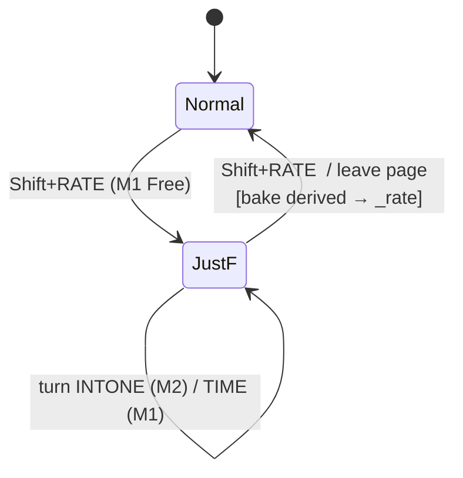

# feat: modulator JustF rate-link mode

A transient "JustF" mode on the modulator page that links all eight modulators'
Free rates to M1 via a single **INTONE** spread (Just Friends / ochd model): turn
INTONE and M2–M8 fan out to harmonic (CW) / subharmonic (CCW) multiples of M1's
rate, clamped so the fastest never aliases. Exit bakes the derived rates into each
modulator's own `_rate`, leaving eight independent LFOs frozen at the spread.

Confirmed spec (design conversation 2026-06-10):

- **Toggle**: Shift+RATE on any modulator (Free-domain only).
- **Transient** — no serialized INTONE, no JustF flag; the project stores only the
  resulting `_rate`s.
- **Enter**: master = M1's current rate; INTONE = default 0 (unison).
- **Live**: engine derives M2–M8 = `clamp(M1 × ratio(INTONE, index))`, B-clamp so
  M8 ≤ 16 Hz; you hear the spread as you turn INTONE.
- **UI**: M1 = normal RATE; M2 RATE cell → INTONE + tiny derived-Hz readout;
  M3–M8 RATE → derived, read-only.
- **Exit** (Shift+RATE *or* leaving the page) = **bake**: write each modulator's
  current derived rate into its own `_rate`. Independent again, frozen; INTONE gone.
- **Re-enter**: M1 rate + default INTONE 0, no memory.

---

## Problem Frame

Each modulator has an independent Free rate (centi-Hz, `Modulator::rateHz`, clamped
0.01–16 Hz). To get the ochd/Just Friends behaviour — eight related-but-drifting
LFOs from one gesture — a user must hand-set eight rates to non-harmonic ratios.
JustF turns that into two controls: M1's rate (master) and one INTONE spread. The
mode is a *tool*, not a persistent link: it derives live so you can audition, then
bakes the result into the normal per-modulator rates on exit.

The key musical/technical constraints (from the conversation):
- **INTONE is index-proportional** (Just Friends): noon = unison, full CW =
  M_k = k× M1, full CCW = M_k = M1/k.
- **Non-integer INTONE positions give ochd-style organic drift for free** (no
  separate drift/lock toggle).
- **Clamp B** (master headroom): raise INTONE and M1's usable top backs off so the
  fastest follower stays ≤ 16 Hz — preserves the ratio spread instead of letting
  fast followers converge/alias.

---

## Scope Boundaries

In scope: the transient JustF mode end to end — engine rate derivation + B-clamp,
the Shift+RATE toggle, INTONE editing on M2, the per-modulator readouts, and
bake-on-exit. Free-domain only.

### Deferred to Follow-Up Work
- An all-eight **spread overview** page (the ochd "fan" showing every derived rate
  at once). The per-modulator page shows one follower's derived rate at a time; the
  overview was explicitly parked.
- CV / routing control of **TIME** (Just Friends' 1V/oct exponential rate input).

### Out of scope (non-goals)
- Any **Tempo-domain** spread — JustF is Free-only.
- Serializing INTONE or a JustF flag — both are runtime-only by design.
- Per-modulator editable ratios or a fixed ratio table — INTONE × index supersedes
  both.

---

## Key Technical Decisions

- **Transient state lives on `ModulatorEngine`** (runtime, not the model): a
  `justfActive` bool + an `intone` float (−1..+1). Cleared on engine `reset()`.
  Nothing added to `Modulator`/`Project` serialization → no `ProjectVersion` bump.
- **Master lookup stays in `Engine.cpp`'s modulator loop**, which already ticks
  modulators in index order (M1 = index 0 first), so M1's rate is available to the
  followers the same tick (same ordering guarantee the gate-source work relies on).
  The loop computes each follower's effective Hz and passes it to `tick()` as an
  override; `ModulatorEngine::tick` gains an optional rate-Hz override used in place
  of `modulator.rateHz()` for the Free phase increment.
- **Ratio is index-proportional** (M1 = index 1 → ratio 1):
  harmonic `1 + intone·(k−1)` for intone ≥ 0; subharmonic `1 / (1 − intone·(k−1))`
  for intone < 0.
- **B-clamp on the master**: `masterHz = min(M1.rateHz, 16 / (1 + 7·max(0,intone)))`
  — top clamp only on the harmonic side; subharmonic side leaves M1's full range and
  followers run slower (no top clamp, slow cycles desirable).
- **INTONE hosted on M2's RATE cell** (M2 is a follower anyway, so its rate knob has
  nothing of its own to set). A tiny readout under it shows M2's *own* derived Hz.
- **Bake reuses the existing `setRate`** path — each modulator's current derived Hz
  → its `_rate` (Free centi-Hz). Because the bake uses the clamped values, every
  baked rate is a valid Free rate (≤ 16 Hz).
- **The 16 Hz ceiling is the existing Free max** (`_rate` clamps to 1600 centi-Hz) —
  reuse it, no new constant; it's the smooth-LFO limit at the modulator update rate.

Reference patterns: `ModulatorEngine::freePhaseIncrement` / `gateFromLevel` (existing
static rate/maths helpers, TDD'd in `TestModulator`); the index-ordered modulator
loop in `engine/Engine.cpp`; the re-press-RATE-toggles-domain idiom and the
destinations context-menu toggle already in `ui/pages/ModulatorPage.cpp`.

---

## High-Level Technical Design

Directional only — context for review, not code to reproduce.

```
Engine.cpp modulator loop (per tick, index 0..7):
    if modulatorEngine.justfActive():
        masterHz = min(modulator(0).rateHz(), 16 / (1 + 7*max(0,intone)))
        effHz    = masterHz * intoneRatio(intone, index+1)        # index1-based
        tick(..., modulator, index, gate, rateHzOverride = effHz)  # Free only
    else:
        tick(..., modulator, index, gate)                          # normal

intoneRatio(intone, k):   # k=1 → 1.0 (M1 identity)
    intone >= 0 ?  1 + intone*(k-1)
                :  1 / (1 - intone*(k-1))
```

UI state machine (ModulatorPage):



---

## Implementation Units

### U1. Engine — JustF rate derivation, ratio + B-clamp, tick override
**Goal:** `ModulatorEngine` holds the transient JustF state and derives each
modulator's Free rate from M1 × INTONE ratio with the B-clamp; `Engine.cpp` feeds
the derived rate into `tick()` while JustF is active.
**Dependencies:** none.
**Files:**
- `src/apps/sequencer/engine/ModulatorEngine.h` (transient `justfActive`/`intone`
  + accessors; static `intoneRatio` / `justfMasterHz` / `justfEffectiveHz` helpers;
  `tick` rate-Hz override param; `reset()` clears the state)
- `src/apps/sequencer/engine/Engine.cpp` (modulator loop: read M1 rate, compute each
  follower's effHz, pass as override)
- `src/tests/unit/sequencer/TestModulator.cpp` (ratio + clamp cases)
**Approach:** Keep the helpers pure/static so they're unit-testable like the existing
`freePhaseIncrement`/`gateFromLevel`. `intoneRatio` is 1-based on index (M1 = 1 →
1.0). `justfMasterHz` applies the top clamp only for intone ≥ 0. `justfEffectiveHz`
= masterHz × ratio, final-clamped ≤ 16 Hz (and a low floor matching the engine's
slow end). `tick` uses the override only when the modulator is Free; Tempo
modulators ignore JustF (see deferred note).
**Execution note:** Implement the ratio + clamp helpers test-first (pure functions,
mirrors how `freePhaseIncrement`/`gateFromLevel` were built).
**Patterns to follow:** `ModulatorEngine` static helpers + their `TestModulator`
cases; the index-order modulator loop in `engine/Engine.cpp`.
**Test scenarios:**
- `intoneRatio(0, k)` == 1.0 for k = 1,2,8 (unison).
- `intoneRatio(+1, 2)` == 2, `intoneRatio(+1, 8)` == 8 (harmonic extreme).
- `intoneRatio(-1, 2)` == 0.5, `intoneRatio(-1, 8)` ≈ 0.125 (subharmonic extreme).
- `intoneRatio(intone, 1)` == 1.0 for any intone (M1 is identity).
- `justfMasterHz(16Hz, +1)` == 2 Hz (clamped so M8 = 16); `justfMasterHz(16Hz, 0)`
  == 16 Hz (no clamp); `justfMasterHz(16Hz, -0.5)` == 16 Hz (subharmonic side
  unclamped).
- `justfEffectiveHz(anyM1, intone≥0, 8)` ≤ 16 Hz (top never aliases).
- `justfEffectiveHz(m1, 0, k)` == m1 for all k (unison).
- Edge: `intone` clamps to [−1, +1]; index out of 1..8 guarded.
**Verification:** `TestModulator` green; sim + STM32 build; with `justfActive` set,
modulators run at the spread (sim/manual), M8 never exceeds 16 Hz at any INTONE.

### U2. UI — Shift+RATE toggle, INTONE control, readouts, bake-on-exit
**Goal:** `ModulatorPage` drives JustF: Shift+RATE toggles it, M2's RATE cell hosts
INTONE with a derived-Hz readout, M3–M8 show derived read-only rate, and exiting
(toggle or leaving the page) bakes the derived rates into each `_rate`.
**Dependencies:** U1.
**Files:**
- `src/apps/sequencer/ui/pages/ModulatorPage.h`
- `src/apps/sequencer/ui/pages/ModulatorPage.cpp`
- `ui-preview/pages_modulator.py` (renders already exist:
  `ui-preview/modulator-justf/justf-time.png`, `-intone.png`, `-follower.png`)
**Approach:**
- **Toggle**: in `keyPress`, Shift+RATE (F2 + shift) flips
  `_engine.modulatorEngine().setJustfActive(...)`. Only enters when M1 is Free
  (Free-domain only); turning it off triggers bake.
- **Enter**: set INTONE to 0 (default/unison).
- **Encoder**: when JustF active and RATE is the focused function — on M1 edit the
  master rate; on M2 edit INTONE (clamp −1..+1; finer taper near 0, exact mapping
  deferred); on M3–M8 no-op (read-only).
- **Draw**: when JustF active, the RATE grid cell (and F2 footer label) per
  modulator — M1 = normal rate / "RATE"; M2 = INTONE value / "INTONE" + tiny
  derived-Hz line beneath it; M3–M8 = derived Hz, dim, footer "RATE". (Renders
  already pinned this layout.)
- **Bake**: a helper that writes each modulator's current derived Hz into its
  `_rate` (via `setRate`, Free centi-Hz), then clears `justfActive` and resets
  INTONE; called on toggle-off and from `exit()` when active.
- `printIntone` for the value formatting.
**Patterns to follow:** the re-press-RATE-domain-toggle and destinations
context-menu toggle in `ui/pages/ModulatorPage.cpp`; the existing right-panel value
grid + footer relabel (mirrored in the ui-preview renders).
**Test scenarios:**
- `Test expectation: none` for the pure draw/relabel (no isolated seam) — covered by
  build + the existing ui-preview renders.
- Behavioral (sim/manual): toggle on with M1 Free → M2–M8 audibly spread; turn
  INTONE → derived rates change live; toggle off → each `_rate` equals its derived
  value at toggle time; leave the page while active → same bake occurs; re-enter →
  INTONE starts at 0 and M1 is master again.
- Edge: Shift+RATE while M1 is in Tempo domain → no-op (Free-domain only).
**Verification:** sim + STM32 build, flash under the 983040 ceiling; ui-preview
renders match the three JustF states; manual run confirms enter/spread/bake/re-enter
per spec.

---

## System-Wide Impact

- Engine timing + modulator UI only. No model/serialization change, no
  `ProjectVersion` bump, no new tick-rate buffers (transient floats/bools only).
- The modulator loop in `Engine.cpp` gains a per-tick rate computation when JustF is
  active (8 cheap multiplies/clamps) — negligible CPU; zero when inactive.
- Resource estimate: flash ~0.5–1 KB (ratio/clamp + UI relabel/readout/bake), RAM
  ~negligible (a bool + a float on `ModulatorEngine`).

---

## Deferred Implementation Notes

- **INTONE knob taper** — finer resolution near 0 (Just Friends' shaping); exact
  step/curve decided at implementation.
- **Tempo-domain followers** — JustF is Free-only; a modulator left in Tempo while
  JustF is active should be ignored by the spread (or forced Free on bake). Resolve
  the exact handling when wiring U2's bake.
- **Transient-state home** — `ModulatorEngine` is the assumed owner; if the master
  lookup proves cleaner with the flag on `Engine`, decide during U1.
- **Header mode label** — the real `WindowPainter` can show a `JUSTF` title; the
  ui-preview stub doesn't render it, so the footer relabel is the visible cue in
  previews.

---

## Verification Strategy

Per unit: `TestModulator` for U1's pure helpers (ratio + clamp), sim debug build +
run, STM32 release build (flash under ceiling). U2 verified by build + the existing
ui-preview renders + a manual enter/spread/bake/re-enter pass. Each unit lands as its
own commit; no `ProjectVersion` bump (no serialized layout change).
