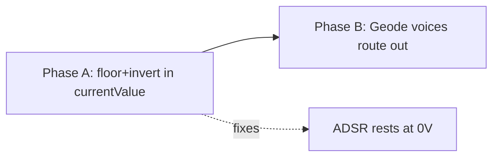

# feat: modulator output transform (floor + invert) + Geode mode

Two sequenced capabilities on the modulator bank.

**Phase A — output transform.** Every modulator gets a uniform `{floor, invert}`
applied at the point its `currentValue` (0–127) is finalized, so all three consumers
(CV via `applyModulatorOffset`, MIDI via `sendModulator`, CV-route Mod1–8 sources)
inherit it consistently. `floor` sets the silence/rest level; `invert` flips the shape
around its range. This also repairs the ADSR resting level — today an envelope rests at
value 0 → −5V at the jack (the CV path centres on 64); floor-aware output rests it at 0V.

**Phase B — Geode mode (first cut).** A bank-wide toggle (Shift+Shape, mutually
exclusive with JustF) that drives the existing `GeodeEngine` from the modulators:
**M1 = clock** (its phase → Geode's `measureFraction`), **M2 = run** (its output →
the RUN parameter), **M3–M8 = the 6 GeodeEngine voices** (gate source fires a voice's
burst, `divs`/`repeats` per voice, global `TIME/INTONE/RAMP/CURVE/MODE` shared). Voice
levels become each modulator's `currentValue`, routed out through the existing matrix —
which is why Phase A (floor-aware unipolar output) is the prerequisite. First cut
**defers tune ratios, MIX output, and quantize** (`GeodeEngine` already implements them;
they're not wired this pass).

This is **dev** — no shipped-project compatibility constraint; the ADSR output change is
a fix, not a migration.

---

## Key Technical Decisions

- **Transform lives in `currentValue` finalization**, not per-consumer. One helper
  applies `{floor, invert}` to each shape's computed 0–127 value before it's stored, so
  CV/MIDI/CV-route all see the same transformed value. Avoids fixing three output paths.
- **`floor` reuses the existing `_offset` field** (`int8`, −64..63) — no new storage. It
  becomes the output baseline applied to *all* shapes, including ADSR/Geode voices that
  ignore `offset` today. Unipolar shapes: `level[0..1] → [restValue .. 127]` where
  `restValue = 64 + offset` (default offset 0 → rest 64 = 0V, peak 127 = +5V). Bipolar
  shapes keep `offset` as their existing bias. The exact unipolar scaling is TDD'd in U2.
- **`invert` is a new 1-bit flag**, forward-compatibly encoded (spare high bit of an
  existing 0–127 `uint8` field, e.g. `_amplitude`, or a packed `_flags` byte) — no
  ProjectVersion bump. `invert`: `v → 127 − v` on the final 0–127 value, applied before
  floor so a unipolar envelope rests at the floor and *ducks* on trigger.
- **Geode reuses `GeodeEngine` unchanged** — the engine already has voices, AR+ramp+curve
  envelopes, run physics, and the 3 modes. Phase B is wiring (clock/run/trigger/output +
  UI + param storage), not envelope or physics code.
- **Geode config is a dedicated persisted block on `Project`** —
  `GeodeConfig { active, time, intone, ramp, curve, mode, divs[6], repeats[6],
  tuneNum[6], tuneDen[6] }`, mirroring the runtime `GeodeParams` ranges so the handoff to
  `GeodeEngine.update` / `setVoiceTune` is identical. Modulator model fields stay
  **untouched** — the M1 and M3–M8 pages are *views* into this block, so entering/exiting
  Geode never overwrites a modulator's normal shape params and exit reverts M3–M8
  instantly. Chosen over overloading unused modulator fields because M1/M2 stay live
  (clock/run taps) and can't double as storage without conflict.
- **`GeodeParams` (Teletype) stays runtime-only and untouched.** The shared piece is
  `GeodeEngine` itself (its `update()` float interface); both front-ends normalize their
  own param storage into it. The new `GeodeConfig` is the *persisted* counterpart for the
  modulator front-end — `GeodeParams` is never serialized.
- **`GeodeConfig.active` is the persisted mode flag**, mutually exclusive with JustF's
  (transient) engine flag: the Shift+Shape toggle clears JustF, Shift+Rate clears `active`.
- **`tune` is provisioned but dormant in first cut** — `tuneNum`/`tuneDen` serialize and
  default to the integer series (voice *i* = (i+1):1, matching `GeodeEngine::reset()`),
  but are neither applied nor editable yet. The engine self-defaults identically, so
  deferring the apply is behaviorally free; wiring tune later is a UI cell + one
  `setVoiceTune` call, no model change.
- **Mode entry: Shift+Shape**, parallel to JustF's Shift+Rate.

---

## High-Level Technical Design

```
// Phase A — output transform, applied where each shape finalizes its value:
applyOutputTransform(rawValue01_or_127, modulator):
    v = shape's natural 0..127           // (existing per-shape computation)
    if modulator.invert(): v = 127 - v
    // floor: unipolar shapes rest at 64+offset and rise to 127; bipolar keep offset bias
    return placed value, clamped 0..127
  -> _currentValue[index] = applyOutputTransform(...)
  -> CV (applyModulatorOffset), MIDI (sendModulator), CV-route Mod1-8 all read it

// Phase B — Geode driver, in Engine.cpp's modulator loop when geodeActive:
    measureFraction = M1.phase                         // M1 = clock
    run             = (M2.currentValue - 64)/64        // M2 = run, bipolar
    for voice i in 0..5 (modulators M3..M8):
        if voice gate rising: geode.triggerVoice(i, divs_i, repeats_i)   // gate = burst
    geode.update(dt, measureFraction, TIME, INTONE, RAMP, CURVE, run, MODE)  // globals from M1
    for voice i: _currentValue[M3+i] = geode.voiceLevel(i) * 127          // -> routing
```

*Directional guidance for review, not implementation specification.*



---

## Scope Boundaries

In scope:
- Phase A: `{floor, invert}` transform on `currentValue`, all 8 shapes; UI for both.
- Phase B (first cut): Shift+Shape Geode toggle; M1 clock + globals; M2 run; M3–M8
  voices (gate-triggered bursts, `divs`/`repeats`); voice level → `currentValue` → routing;
  reuse of the grid + destinations UI; param persistence.

### Deferred to Follow-Up Work
- Geode **tune ratios** (`G.TUNE` — per-voice `ratio^intone`) — **storage provisioned in
  `GeodeConfig` (U4) and dormant**; wiring later is a voice-page cell + one `setVoiceTune`
  call, no model change.
- Geode **MIX** output (JF `max(voice/i)`) and **quantize** (`G.QT`) — present in
  `GeodeEngine`, no config provisioned this pass (MIX is an output-mode flag, quantize one
  future global field).
- INTONE knob taper (carried from the JustF plans).

### Out of scope
- Changing `GeodeEngine`'s envelope/physics/mode math.
- Teletype's existing Geode path — untouched; this adds a parallel modulator-driven front-end.

---

## Implementation Units

### U1. Model — floor reuse + invert field (TDD)

**Goal:** Expose `invert` on the modulator model and make `offset` (floor) available to
the envelope path; forward-compatible encoding, no version bump.

**Requirements:** `invert` accessor + serialize (packed bit); `offset` already exists and
stays `int8 −64..63`; `clear()` defaults keep envelopes resting at 0V.

**Dependencies:** none.

**Files:**
- `src/apps/sequencer/model/Modulator.h` — `invert()`/`setInvert()`; pack into a spare bit;
  serialize. Possibly a `floorValue()` helper deriving `64 + offset`.
- `src/tests/unit/sequencer/TestModulator.cpp` — new CASE block.

**Approach:** Add `invert` as a packed bit (spare high bit of `_amplitude` or a `_flags`
byte), serialized unconditionally with the existing fields. Keep `offset` semantics; add
a helper that maps `offset` → the unipolar rest value (`64 + offset`, clamped 0..127).

**Execution note:** Test-first — mirror existing TestModulator CASE style.

**Patterns to follow:** existing `_offset` accessors/serialize in `Modulator.h`; the
JustF/gate-source serialize-unconditionally pattern.

**Test scenarios:**
- `invert` defaults false; set/get round-trips; survives write→read.
- `invert` bit-pack does not corrupt the host field's 0–127 value (e.g. amplitude 127 + invert).
- `floorValue()` = `64 + offset`: offset 0 → 64, offset −64 → 0, offset +63 → 127, clamped.
- Serialize→deserialize preserves `offset` + `invert` together.

**Verification:** TestModulator green; a modulator round-trips invert+offset.

---

### U2. Engine — `{floor, invert}` output transform on currentValue (TDD)

**Goal:** Every shape's final 0–127 output passes through `{floor, invert}` so all
consumers see a consistent transformed value; ADSR/Geode rest at the floor.

**Requirements:** invert flips (`127−v`); unipolar shapes (ADSR, later Geode) map level →
`[floorValue .. 127]`; bipolar shapes keep offset bias; default rests ADSR at 0V.

**Dependencies:** U1.

**Files:**
- `src/apps/sequencer/engine/ModulatorEngine.h` — a static/inline
  `applyOutputTransform(value, modulator)` (or per-shape application) at each
  `_currentValue[index] = …` site; ADSR branch switches to the unipolar floor mapping.
- `src/tests/unit/sequencer/TestModulator.cpp` — extend.

**Approach:** Centralize the transform: after a shape computes its 0–127 value, apply
invert then floor placement, clamp, store. ADSR currently `clamp(value,0,127)` resting at
0 → change to map its level into `[floorValue..127]`. Bipolar shapes already centre at 64
via `+offset+64`; invert applies; floor = their offset (unchanged meaning). Keep the
transform branchless and cheap (per-tick, per-modulator).

**Execution note:** Test-first on the transform math (pure given value+modulator).

**Patterns to follow:** the per-shape `_currentValue[index]` finalization in
`ModulatorEngine.h`; `justfEffectiveMs` static-helper test style.

**Test scenarios:**
- Invert bipolar: input 64 (centre) → 63 (≈centre); 127 → 0; 0 → 127.
- Unipolar ADSR floor: level 0 with offset 0 → 64 (0V); level max → 127 (+5V).
- Unipolar floor offset: offset −64 → rest 0 (−5V, the classic); offset +63 → rest near top.
- Invert + floor (duck): inverted envelope rests at top of its window, dips toward floor.
- Bipolar offset bias unchanged vs today (regression: LFO with offset matches prior output).
- Clamp: no value escapes 0..127 for any offset/invert combination.

**Verification:** TestModulator green; sim audition — ADSR rests at 0V and rises; invert
ducks; LFO unchanged. STM32 release green, under the 983040 flash ceiling.

---

### U3. UI — surface floor + invert on the modulator page

**Goal:** Edit `offset` (floor) and toggle `invert` from the page, including on ADSR where
the offset slot is currently taken by sustain.

**Requirements:** floor editable for all shapes; invert toggle reachable; ADSR gets an
offset cell (page 2 has room beside AMPLITUDE); render validated.

**Dependencies:** U1, U2.

**Files:**
- `src/apps/sequencer/ui/pages/ModulatorPage.{h,cpp}` — add an OFFSET/FLOOR cell on ADSR
  page 2; an INVERT toggle (footer slot or a cell); encoder/keypress wiring.
- `ui-preview/pages_modulator.py`, `ui-preview/generate.py`, `ui-preview/modulator/` —
  proposed renders.

**Approach:** Non-ADSR shapes already show OFFSET — relabel intent to "floor" only if
useful; otherwise leave. ADSR page 2 (`AMPLIT` + empties) gains a FLOOR cell. INVERT is a
boolean — host it on a footer slot or a page-2 cell as a label toggle. Validate placement
by render before finalizing.

**Execution note:** UI proposal — render with `ui-preview` and `open` before sign-off.

**Patterns to follow:** the ADSR page-2 layout used for JustF INTONE
(`ui-preview/modulator-justf/justf-adsr-intone-page2.png`); existing offset edit path.

**Test scenarios:** `Test expectation: none — display/binding`. Validate via render
(no collision, safe area y=11..52) + on-device edit reaching the model.

**Verification:** render shows floor + invert without collision; editing changes the
model and audibly shifts/flips the output.

---

### U4. Model — `GeodeConfig` persisted block on Project (TDD)

**Goal:** A dedicated, serialized `GeodeConfig` holding all Geode state — mode flag,
globals, per-voice `divs`/`repeats`, and provisioned-dormant `tune` — leaving every
modulator's own fields untouched.

**Requirements:** `active` (mutually exclusive with JustF); globals
`TIME/INTONE/RAMP/CURVE/MODE`; per-voice `divs[6]`/`repeats[6]`; `tuneNum[6]`/`tuneDen[6]`
serialized + defaulted but unused; ranges match `GeodeEngine`/`GeodeParams`.

**Dependencies:** none (Phase B; sequenced after Phase A for clarity).

**Files:**
- `src/apps/sequencer/model/GeodeConfig.h` (new) — the struct + accessors + `clear()` +
  `write`/`read`.
- `src/apps/sequencer/model/Project.h` / `Project.cpp` — a `GeodeConfig _geode` member,
  accessor, and its `write`/`read` appended to Project serialization.
- `src/tests/unit/sequencer/` — a `TestGeodeConfig` unit (or extend an existing model test).

**Approach:** Mirror the `GeodeParams` field shapes (int16 normalized globals, `mode`
uint8, `tuneNum`/`tuneDen` int16 arrays) plus `divs[6]`/`repeats[6]`. `clear()`: `active`
false, sensible global defaults, `divs`=1, `repeats`=0, `tune` = (i+1):1. Append the
block to Project serialization (old dev files won't load — accepted). The M1/voice UI
pages (U6) edit this block as a view; the engine driver (U5) reads it. Provide ranged
setters (`setDivs` 1–64, `setRepeats` −1..255, `setMode` 0–2).

**Execution note:** Test-first on `clear()` defaults + ranged setters + serialize round-trip.

**Patterns to follow:** `GeodeParams` field set in `TeletypeTrackEngine.h`; an existing
model struct's `write`/`read`/`clear` (e.g. `Modulator`'s) for the serialization shape.

**Test scenarios:**
- `clear()` defaults: `active` false; `divs[i]`=1, `repeats[i]`=0; `tuneNum[i]`=i+1,
  `tuneDen[i]`=1; globals at their neutral values.
- Ranged setters clamp: `divs` 1–64, `repeats` −1..255, `mode` 0–2.
- Serialize→deserialize round-trips every field including the dormant `tune` arrays.
- Mutual exclusion is enforced by the toggle (tested in U6), not the struct — the struct
  just holds `active`.

**Verification:** the new model test is green; a project carrying a `GeodeConfig`
round-trips through write/read.

---

### U5. Engine — drive GeodeEngine from the modulator bank

**Goal:** When geode-active, the modulator loop clocks `GeodeEngine` from M1, feeds run
from M2, triggers M3–M8 voices from their gate sources, and writes voice levels into
`currentValue`.

**Requirements:** M1 phase → `measureFraction`; M2 output → run; per-voice gate rising →
`triggerVoice(divs, repeats)`; `GeodeEngine.update` with M1 globals; `voiceLevel(i)*127`
→ `currentValue(M3+i)`; voices route out through Phase A's floor (unipolar).

**Dependencies:** U2 (floor-aware output), U4 (params/flag).

**Files:**
- `src/apps/sequencer/engine/Engine.cpp` — a Geode branch in the modulator loop; own a
  `GeodeEngine` instance (or reuse a shared one) clocked here.
- `src/apps/sequencer/engine/ModulatorEngine.h` — accept externally-driven voice levels
  for M3–M8 when geode-active (bypass the normal per-shape tick for those).

**Approach:** Mirror `TeletypeTrackEngine::triggerGeodeVoice`'s measureFraction/run/trigger
logic but source `measureFraction` from M1's phase and `run` from M2's `currentValue`.
Resolve each voice's gate via the existing gate-source path (already wired for modulators);
a rising edge triggers that voice's burst with `divs`/`repeats` read from `GeodeConfig`.
Call `GeodeEngine.update(dt, …)` once per engine update with the globals from `GeodeConfig`
(`tune` left at the engine's own defaults this pass). Write `voiceLevel(i)*127` into
`currentValue(M3+i)`; the output transform (U2) then places it on the floor. M1/M2 keep
ticking as normal modulators (their outputs are *tapped*, not overwritten).

**Execution note:** Engine integration — exercise via sim audition; unit-cover the
M1-phase→measureFraction and M2→run mappings if extracted as pure helpers.

**Patterns to follow:** `TeletypeTrackEngine.cpp` Geode driver (measureFraction, run
normalize, trigger, `update`); the modulator gate-source resolve in `Engine.cpp`
(`resolveSourceLevel` + `gateFromLevel`).

**Test scenarios:**
- M1-phase → measureFraction wraps 0→1 correctly (pure mapping, unit).
- M2 output 64 → run 0; 127 → +1; 0 → −1 (pure mapping, unit).
- Sim: gate on M5 fires a burst of `repeats` envelopes at `divs` across M1's measure;
  INTONE spreads voice times; MODE/run change the burst amplitudes.
- Voices route to CV resting at the floor (Phase A), not −5V.
- M1/M2 still output normally as modulators while Geode runs.

**Verification:** sim audition — a clocked polymetric burst bank driven by M1/M2, voices
out through routing. STM32 release green, under the flash ceiling.

---

### U6. UI — Shift+Shape toggle + Geode role pages

**Goal:** Toggle Geode with Shift+Shape; show M1 globals, M3–M8 voice params, reuse the
destinations page for gate + output; M2 stays a normal page.

**Requirements:** Shift+Shape enters/exits Geode (clears JustF); M1 page 2 = the 5
globals; M3–M8 page 1 = `DIVS/REPEATS` (+ read-only derived time); destinations page
unchanged for gate+routing; matches the signed-off renders.

**Dependencies:** U4, U5.

**Files:**
- `src/apps/sequencer/ui/pages/ModulatorPage.{h,cpp}` — Shift+Shape handler; role-keyed
  cell population (M1 globals, voice params); footer relabels.
- `ui-preview/pages_modulator.py`, `ui-preview/generate.py` — renders already added:
  `modulator-geode-globals`, `modulator-geode-voice`.

**Approach:** Shift+Shape mirrors JustF's Shift+Rate entry, with mutual exclusion (clears
JustF, sets `GeodeConfig.active`). In Geode mode the cells are **views into `GeodeConfig`**,
not modulator fields: M1 page-2 cells edit the globals `TIME/INTONE/RAMP/CURVE/MODE`;
M3–M8 page-1 cells edit `divs[i]`/`repeats[i]` (+ a read-only derived envelope time); M2
unchanged. Gate source + output = the destinations page (reused). Re-render if layout shifts.

**Execution note:** UI proposal — renders exist
(`ui-preview/modulator-geode/geode-globals.png`, `geode-voice.png`); re-render on change.

**Patterns to follow:** JustF Shift+Rate toggle + bake lifecycle in `ModulatorPage.cpp`;
the role-keyed cell population from the JustF-ADSR work; `ui-preview/UI-VARIANTS.md`.

**Test scenarios:** `Test expectation: none — display/binding`. Validate via renders +
on-device: Shift+Shape enters Geode (JustF clears), globals/voice cells edit the model,
MODE/CURVE show labels not numbers.

**Verification:** Shift+Shape toggles the bank; pages match the signed-off renders;
editing reaches the params U5 consumes.

---

## Deferred to Implementation

- **invert bit host** — spare high bit of `_amplitude`/`_sustain` vs a new `_flags` byte.
  Decide in U1.
- **GeodeEngine instance ownership** — a dedicated instance owned by `Engine` for the
  modulator-driven path vs sharing Teletype's. Decide in U5 (likely dedicated, to avoid
  coupling the two front-ends).
- **Exact unipolar floor scaling** — the level→[floor..127] curve, validated by U2 tests.

---

## System-Wide Impact

- **No ProjectVersion bump** — invert is a packed bit; `GeodeConfig` is a dedicated block
  appended to Project serialization (old dev files won't load — accepted, no shipped files).
- `currentValue` semantics change for ADSR (rests at floor, not 0) — a fix; affects CV,
  MIDI, and CV-route Mod1–8 consumers uniformly (the reason the transform is centralized).
- Geode mode conscripts the whole bank (M1 clock, M2 run, M3–M8 voices) — no independent
  modulators while active, mutually exclusive with JustF.
- Flash: Phase A is small; Phase B adds the GeodeEngine link + UI (GeodeEngine already
  compiled). Must stay under 983040 (last build 951372). Confirm in U2 and U5 STM32 builds.

---

## Verification Strategy

- U1/U2/U4: `TestModulator` green (encoding, transform math, param round-trip).
- U3/U6: `ui-preview` renders reviewed + signed off before UI lands.
- U5: sim audition — M1-clocked, M2-run polymetric burst bank, voices routed out at the floor.
- Whole branch: STM32 release green and under the flash ceiling.
- Commit per unit when the user asks; do not auto-commit.
