# Modulator Manual

## Introduction

The **Modulator bank** is a set of 8 independent CV sources that run alongside
the tracks. Each slot generates a continuous control signal — an LFO, an
envelope, a random walk, a chaotic attractor, or a struck-spring resonator —
and routes that signal to CV outputs, the internal modulation bus, or MIDI. The
bank is not a track: it has no steps and no pattern. It is a panel of 8 knobs'
worth of motion you assign wherever you need it.

On top of the per-slot shapes sit two **bank-wide modes** that retune the whole
set at once: **JustF** (a Just Friends / *ochd*-style rate link, where M1 is the
master and the others spread harmonically) and **Geode** (a 6-voice Just-Friends
rhythmic engine driven from the bank). Both are mutually exclusive and toggle
from the same page.

This manual is grounded in the firmware as built. Defaults, ranges, enum
members, key bindings, and label strings are taken from the model
(`Modulator.h`, `GeodeConfig.h`), the engine (`ModulatorEngine.h`,
`GeodeEngine.h`), and the UI (`ModulatorPage.cpp`).

## Prerequisites

Before working with the Modulator bank you should have:

- Familiarity with the xformer page model (Page+ combos, F-keys, the encoder).
- Understanding of CV/gate conventions (1V/oct, the ±5V / 0..127 output stage where 64 = 0V).
- A destination in mind — a CV output, a routing target, or a MIDI CC — for the modulator's signal.

---

# Part 1: Overview

## What the Modulator bank is

The bank holds **8 modulator slots** (M1..M8, `CONFIG_MODULATOR_COUNT = 8`).
Each slot is one `Modulator` object: a shape plus its parameters. Every slot is
evaluated each engine tick by `ModulatorEngine`, producing a single output value
in **0..127** (64 = 0V at the CV stage). That value is then routed.

A slot is **always running** — there are no steps to advance. What changes the
output is the shape's own motion (an LFO phase, an envelope state machine, a
random sample-and-hold) and the slot's **gate behavior**, which decides whether
the shape free-runs or is triggered/held by an external gate.

## The three things that define a slot

- **Shape** — which generator runs (10 choices, below).
- **Parameters** — the shape's controls (rate, depth, envelope times, …). One canonical param table is reinterpreted per shape; Spring relabels its reused fields.
- **Routing** — where the output goes (CV outputs, bus CV, MIDI), plus the gate source and run mode.

## The two bank-wide modes

- **JustF** — relabels M1's rate into a master and spreads M2..M8 harmonically from it. M2 hosts the global **INTONE** spread. Toggle: Shift+RATE.
- **Geode** — converts the bank into a 6-voice rhythmic engine. M1 holds the shared globals, M2 is the run source, M3..M8 are the six voices. Toggle: Shift+SHAPE.

Geode and JustF cannot both be active; turning one on turns the other off.

---

# Part 2: The 10 Shapes

`Modulator::Shape` enumerates ten generators.

| # | Enum | Label | Family |
|---|---|---|---|
| 0 | Sine | Sine | LFO |
| 1 | Triangle | Triangle | LFO |
| 2 | SawUp | Saw Up | LFO |
| 3 | SawDown | Saw Down | LFO |
| 4 | Square | Square | LFO |
| 5 | Random | Random | sample-and-hold |
| 6 | ADSR | ADSR | envelope |
| 7 | ChaosLorenz | Lorenz | chaos |
| 8 | ChaosLatoocarfian | Latoocarfian | chaos |
| 9 | Spring | Spring | physical resonator |

The five LFO shapes share one param layout. Random, ADSR, Chaos, and Spring each
have their own. The shape is changed by focusing **SHAPE** (F1) and turning the
encoder.

## LFO shapes (Sine / Triangle / Saw Up / Saw Down / Square)

A bipolar waveform scaled by depth and shifted by offset, with a phase control.

| Param | Code field | Default | Range | Effect |
|---|---|---|---|---|
| RATE | `_rate` | 0.05 Hz (Free) | Free 0.01–16 Hz; Tempo 1/64..16 bars | Oscillation speed; domain-keyed (below) |
| DEPTH | `_depth` | 25 | 0–127 | Output amplitude (127 = full swing) |
| PHASE | `_phase` | 0° | 0–359° | Phase offset of the waveform |
| OFFSET | `_offset` | 0 | −64..+63 | Baseline shift; also sets the rest level via `floorValue()` = clamp(64 + offset) |

The waveforms are generated by `WaveformGenerator`: a parabolic sine
approximation, linear triangle, rising/falling saws, and a 50%-duty square.

## Random

A sample-and-hold of a random value, slewed between samples. The universal
**MODE** decides when it samples (FREE = free-running on the clock, TRIG =
sample on gate rising, HOLD = track-and-hold while gate high).

| Param | Code field | Default | Range | Effect |
|---|---|---|---|---|
| RATE | `_rate` | 0.05 Hz | Free 0.01–16 Hz; Tempo division | Sample clock |
| DEPTH | `_depth` | 25 | 0–127 | Output amplitude |
| SLEW | `_smooth` | 100 ms | 0–5000 ms | Glide time between samples |
| OFFSET | `_offset` | 0 | −64..+63 | Baseline shift |

The slew rate is `(slew_ms × PPQN) / 2500` ticks (minimum 1). Mode behavior is
shared with Chaos.

## ADSR

A gated attack/decay/sustain/release envelope. Unipolar: it rests at the floor
and rises toward the amplitude ceiling. Lives on **two pages** (Right walks the
cursor).

**Page 1** — SHAPE / ATTACK / DECAY / SUSTAIN / RELEASE:

| Param | Code field | Default | Range | Effect |
|---|---|---|---|---|
| ATTACK | `_attack` | 100 ms | 0–2000 ms | Idle → peak time |
| DECAY | `_decay` | 100 ms | 0–2000 ms | Peak → sustain time |
| SUSTAIN | `_sustain` | 100 | 0–127 | Held level |
| RELEASE | `_release` | 200 ms | 0–2000 ms | Sustain → idle after gate falls |

**Page 2** — DEPTH (F3) / INVERT (F4) / OFFSET (F5):

| Param | Code field | Default | Range | Effect |
|---|---|---|---|---|
| DEPTH (amplitude) | `_amplitude` | 127 | 0–127 | Envelope peak level |
| INVERT | `_invert` | OFF | on/off | Flips the envelope within [0, amplitude] so it ducks from the top instead of rising |
| OFFSET (rest V) | `_offset` | 0 | −64..+63 | The rest voltage; shown as volts, e.g. `+1.2V` |

The state machine is Idle → Attack → Decay → Sustain → Release → Idle, driven by
the gate source. Output is mapped through `unipolarOutput(env, amplitude, floor, invert)`.

## Chaos (Lorenz / Latoocarfian)

A chaotic attractor sampled into CV. Two pages.

**Page 1** — SHAPE / RATE / DEPTH / P1 / P2:

| Param | Code field | Default | Range | Effect |
|---|---|---|---|---|
| RATE | `_rate` | 0.05 Hz | Free/Tempo | Integration / step rate |
| DEPTH | `_depth` | 25 | 0–127 | Output amplitude |
| P1 | `_attack` (reused) | — | 0–2000 → 0..1 | First attractor parameter (Lorenz ρ 10..50; Latoocarfian a,b 0.5..3.0) |
| P2 | `_decay` (reused) | — | 0–2000 → 0..1 | Second parameter (Lorenz β 0.5..4.0; Latoocarfian c,d 0.5..3.0) |

**Page 2** — SLEW (F1) / OFFSET (F5):

| Param | Code field | Default | Range | Effect |
|---|---|---|---|---|
| SLEW | `_smooth` | 100 ms | 0–5000 ms | Glide on the sampled value |
| OFFSET | `_offset` | 0 | −64..+63 | Baseline shift |

P1/P2 reuse the ADSR attack/decay storage fields, normalized to 0..1 and
curve-mapped to the attractor's constants. Lorenz integrates with substeps for
stability at high rates; Latoocarfian advances at each phase wrap.

## Spring

A 3-mode inharmonic resonator (a struck "spring"). Two pages. Spring **relabels**
the reused fields for musical clarity.

**Page 1** — SHAPE / STRIKE / TENS / RING / CLANG:

| Label | Reused field | Effect |
|---|---|---|
| STRIKE | `_rate` | Strike (hit) clock |
| TENS | `_attack` | Tension → resonant frequency ω₀ (`0.3 × 40^(attack/2000)` Hz) |
| RING | `_decay` | Ring-out → damping ζ (`0.0015 × 800^(1 − decay/2000)`) |
| CLANG | `_smooth` | Clang character → pickup amplitude weighting (`smooth / 5000`) |

**Page 2** — PICKUP (F1) / DEPTH (F3) / OFFSET (F5):

| Label | Reused field | Effect |
|---|---|---|
| PICKUP | `_phase` (0–4) | Output pickup: Position, Velocity, Kinetic, Potential, Total |
| DEPTH | `_depth` | Strike force (`0.7 × depth/127`) |
| OFFSET | `_offset` | Baseline shift |

The model is a 3-mode resonator with frequency ratios [1.0, 2.76, 5.40],
integrated semi-implicitly, soft-saturated through `tanh` on the way out. See
`docs/spring-modulator-spec.md`.

---

# Part 3: Rate Domain, Mode, Invert, Offset

These four controls are shape-orthogonal — they apply across families.

## Rate domain (Free vs Tempo)

Rate is **domain-keyed**. Re-pressing **RATE** when it is already focused cycles
the domain (on shapes that show RATE on F2).

- **FREE** — wall-time Hz, tempo-independent. Stored as centi-Hz, range 1–1600 (0.01–16 Hz). Runs even when the transport is stopped.
- **TEMPO** — a clock division, tempo-locked. Stored as PPQN ticks, range 6–6144. Freezes when the sequencer stops. Divisions: 6 = 1/64 … 96 = 1/4 … 384 = 1 bar … 6144 = 16 bars.

## Mode (gate behavior)

The universal **MODE** field (`Modulator::Mode`) sets how the gate interacts with
the shape. Labels are FREE / TRIG / HOLD.

| Mode | Label | Behavior |
|---|---|---|
| Run | FREE | Free-running; gate ignored |
| Trig | TRIG | Reset phase to offset on gate rising (offset 0 = hard sync) |
| Gate | HOLD | Advance only while gate high; reset on rising (windowed) |

For Random, FREE/TRIG/HOLD select clocked sample-and-hold / gate-triggered S&H /
track-and-hold respectively.

## Invert and Offset / floor

- **INVERT** flips the output. Unipolar (ADSR / Geode voice) ducks from the top; bipolar (LFO / Random / Chaos) flips around the center.
- **OFFSET** biases the value and sets the **rest level** for unipolar shapes via `floorValue()` = clamp(64 + offset, 0, 127). On ADSR page 2 it is shown directly as a rest voltage.

## Gate source

When MODE is TRIG or HOLD (or Random is triggered), the slot needs a gate. The
**gate source** is selectable from a curated list, cycled in the routing
overlay (F2 GATE):

- GateOut 1–8
- CvIn 1–4
- BusCv 1–4
- Mod 1–8 (one modulator gating another; the slot's own index is filtered out at runtime)

---

# Part 4: JustF (Just Friends rate link)

JustF turns the bank into an *ochd* / Just Friends rate cluster: one master rate
(M1) with the rest spread harmonically. It is **not a shape** — it is a runtime
mode at the engine level (`_justfActive`, `_intone`).

## How the spread works

- **M1** is the master. Its rate (Free-domain) is the reference.
- **INTONE** (−1..+1, hosted on M2) is the spread. Noon = unison; clockwise = harmonic (Mₖ = k × M1); counter-clockwise = subharmonic (Mₖ = M1 / k).
- **M2..M8** derive their rate from M1 and INTONE; on those slots the rate cell is **read-only** (shows the derived Hz).
- A **B-clamp** caps the master so the fastest follower stays ≤ 16 Hz.

For **ADSR** followers, the envelope durations (attack/decay/release) spread by
the same ratio per slot index; sustain is copied from M1 unscaled; amplitude
stays per-slot.

## On the page

- **Shift+RATE** toggles JustF. Only valid when M1's rate domain is Free.
- On **M2**, the F2 cell relabels to **INTONE** and edits the global spread (`%+.2f`). A tiny derived-Hz readout sits under it.
- On **M3..M8**, the rate cell shows the derived rate, read-only.
- **Leaving the page bakes JustF**: the derived rates (and ADSR times) are written into each follower's own fields, then JustF turns off. Tempo-domain slots are left untouched.

---

# Part 5: Geode (6-voice rhythmic engine)

Geode reskins the whole bank into a Just-Friends-style rhythmic / stochastic
clock engine (`GeodeConfig` + `GeodeEngine`). It is a separate subsystem,
mutually exclusive with JustF. **Shift+SHAPE** toggles it; turning it on parks
M2's depth to 0 so the run signal starts neutral.

## Bank layout in Geode mode

- **M1** — the clock. Its page 2 hosts the five shared globals.
- **M2** — the run source.
- **M3..M8** — the six voices (`GeodeConfig::VoiceCount = 6`).

## The five globals (M1 page 2)

All globals are stored 0..16383; intone and curve are bipolar (8192 = centre).

| Label | Code field | Default | Range | Effect |
|---|---|---|---|---|
| TIME | `_time` | 8192 | 0–16383 | Envelope base time, log-mapped and capped (≈ up to 4 s via `MaxTimeNorm = 0.55`) |
| INTONE | `_intone` | 8192 (centre) | 0–16383 → −1..+1 | Voice time spread |
| RAMP | `_ramp` | 8192 | 0–16383 → 0..1 | Attack/decay balance |
| CURVE | `_curve` | 8192 (centre) | 0–16383 → STEP/LOG/LIN/EXP | Envelope shape |
| MODE | `_mode` | 0 | 0–2 | TRANS (Transient) / SUST (Sustain) / CYCLE |

## Per-voice params (M3..M8)

Each voice has its own single page (VOICE / DIVS / REPEAT / TUNE / TIME).

| Label | Code field | Default | Range | Effect |
|---|---|---|---|---|
| DIVS | `_divs[v]` | 1 | 1–64 | Clock divisor for the voice |
| REPEAT | `_repeats[v]` | 0 | −1..255 | Burst count; −1 = INF (infinite) |
| TUNE | `_tuneNum[v]` : `_tuneDen[v]` | (v+1):1 | numerator/denominator | INTONE-ratio override (see note) |
| TIME | (derived) | — | — | The voice's gesture time in ms (read-out) |

> **Tune is provisioned but dormant in this cut.** The numerator/denominator
> fields are stored, defaulted (voice *v* → (v+1):1), and serialized, but not yet
> wired into editing or live engine evaluation. Setting 0/0 resets to the default
> ratio.

The engine outputs a mix level (0..1) and per-voice levels; voices burst on
their divisor with the chosen repeat count, enveloped by the shared globals.

---

# Part 6: The Modulator Page UI

The page header reads **MOD *n* - MODULATOR** (or ROUTING / GEODE). Track buttons
T1..T8 select the modulator slot. The layout is a **left rolling scope** and a
**right param list**.

## Layout

- **Left scope box** (x=1, y=12, 119×40): a live rolling trace of the slot's output (no level bar). Center line at the box midline.
- **Divider** at x=122.
- **Right param list** (x=124, 5 rows, Tiny font): each row is one F-key; **name flush-left, value flush-right**; the selected row is drawn in a bright box.
- **CV routing label** inside the scope box bottom-left (e.g. `-> CV1,CV3`) when the slot is assigned to a CV output.
- A **Pg n/m** counter sits in the header's active-function slot on multi-page shapes.

<figure>
  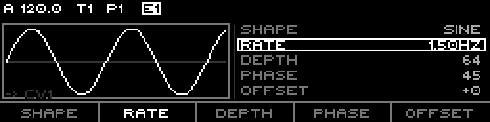
  <figcaption>Sine LFO: scope-left, divider, PhaseFlux param list (SHAPE/RATE/DEPTH/PHASE/OFFSET), RATE focused. CV1 assigned.</figcaption>
</figure>

## F-keys (per shape)

F-key labels are context-dependent. Focusing a function selects it for the
encoder.

- **LFO / Random** (single page): SHAPE / RATE / DEPTH / (PHASE | SLEW) / OFFSET.
- **ADSR** p1: SHAPE / ATTACK / DECAY / SUSTAIN / RELEASE. p2: – / – / DEPTH / INVERT / OFFSET.
- **Chaos** p1: SHAPE / RATE / DEPTH / P1 / P2. p2: SLEW / – / – / – / OFFSET.
- **Spring** p1: SHAPE / STRIKE / TENS / RING / CLANG. p2: PICKUP / – / DEPTH / – / OFFSET.
- **Geode M1** p2: TIME / INTONE / RAMP / CURVE / MODE.
- **Geode voice**: VOICE / DIVS / REPEAT / TUNE / TIME.

## Step grid

The Modulator page **does not handle step keys** (S1..S16). They are ignored.

## Encoder, re-press, Shift, Page+

- **Encoder turn** edits the focused parameter; **encoder pressed + turn** is the fine resolution.
- **Re-press SHAPE (F1)** fires a one-shot **audition** pulse (an ADSR / triggered-Random / Chaos-trig / Geode voice responds; a FREE-mode LFO ignores it).
- **Re-press RATE (F2)** cycles the rate domain Free ↔ Tempo.
- **Shift+SHAPE** toggles **Geode**. **Shift+RATE** toggles **JustF**.
- **Right** walks the cursor: param page(s) → routing overlay. **Left** walks back.

## LEDs

Only the **track button** of the selected modulator lights (bright). Step LEDs
are not driven by this page.

<figure>
  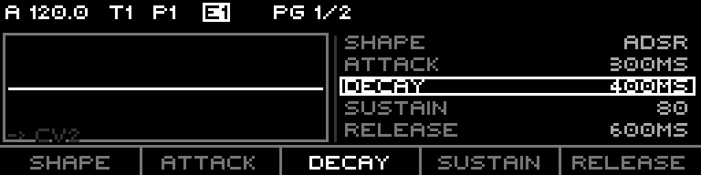
  <figcaption>ADSR page 1: envelope cells ATTACK/DECAY/SUSTAIN/RELEASE, DECAY focused. Pg 1/2 in the header.</figcaption>
</figure>

<figure>
  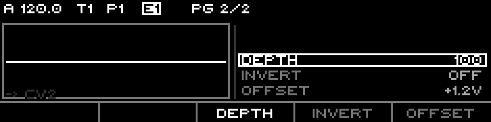
  <figcaption>ADSR page 2: DEPTH (amplitude) / INVERT / OFFSET (rest voltage) in the F3–F5 slots; F1/F2 empty.</figcaption>
</figure>

<figure>
  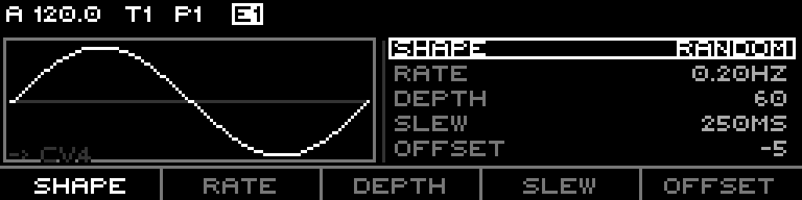
  <figcaption>Random: SHAPE focused; F4 is SLEW (glide between samples). Sampling is governed by MODE.</figcaption>
</figure>

<figure>
  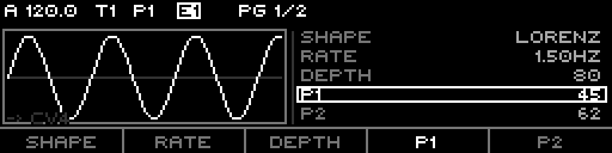
  <figcaption>Chaos (Lorenz) page 1: RATE/DEPTH plus the two attractor params P1/P2, P1 focused.</figcaption>
</figure>

<figure>
  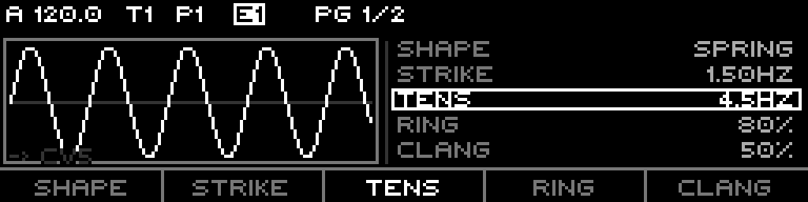
  <figcaption>Spring page 1: reused fields relabeled STRIKE / TENS / RING / CLANG, TENS focused.</figcaption>
</figure>

<figure>
  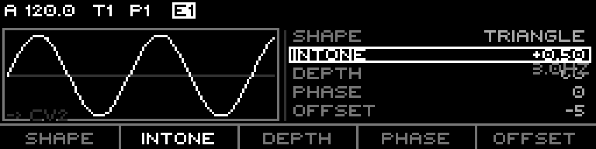
  <figcaption>JustF active, M2: the RATE cell becomes INTONE (global spread); the derived Hz reads small beneath it.</figcaption>
</figure>

<figure>
  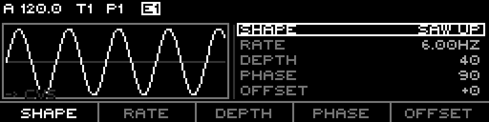
  <figcaption>JustF follower (M5): the RATE cell shows the derived rate (6.00Hz), read-only — spread from M1 + INTONE.</figcaption>
</figure>

<figure>
  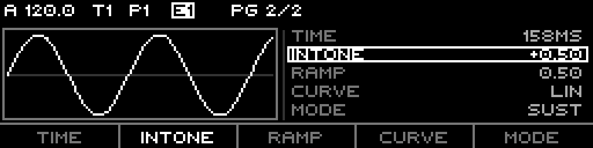
  <figcaption>Geode globals (M1 page 2): TIME / INTONE / RAMP / CURVE / MODE. Header reads GEODE.</figcaption>
</figure>

<figure>
  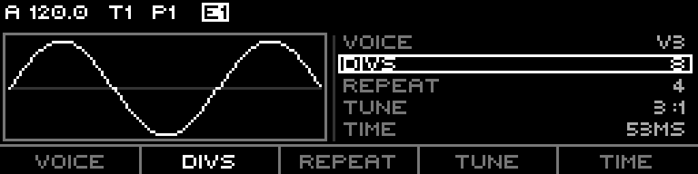
  <figcaption>Geode voice (M5 = voice 3): VOICE / DIVS / REPEAT / TUNE / TIME. Tune defaults to 3:1.</figcaption>
</figure>

---

# Part 7: Routing the output

Press **Right** from the last param page to open the **routing overlay** (header
reads ROUTING). The overlay is a **membership grid**: a modulator can drive
multiple destinations at once.

## The membership grid

- **CV row** — CV 1–8.
- **MIDI rows** — MIDI 1–16.
- A filled cell = assigned; the cursored cell is highlighted.

Encoder turn moves the cursor; **encoder push adds** the cursored destination;
**F3 (CLEAR)** removes it.

## The routing F-keys

The footer reads **RUN / GATE / CLEAR / EVENT / CC NUM**.

- **F1 RUN** — focus the modulator run mode (One / Loop / Cycle), edited by the encoder.
- **F2 GATE** — focus the gate source; encoder cycles the curated source list.
- **F3 CLEAR** — remove the cursored destination from the set.
- **F4 EVENT** — for a cursored MIDI destination, cycle the continuous event (CC / Bend / Pressure).
- **F5 CC NUM** — for a CC event, edit the CC number (0–127).

Routing edits are staged; the context menu (**Shift+Page**) offers **CANCEL**
(revert to the saved routing) and **COMMIT** (apply CV / MIDI assignments).

<figure>
  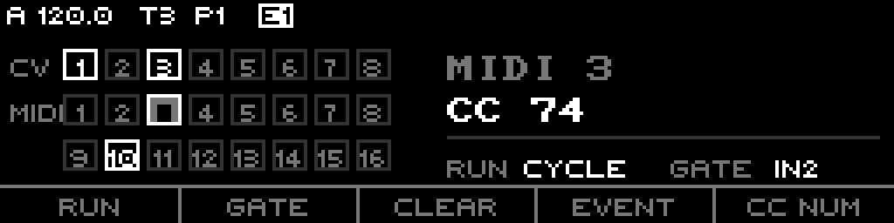
  <figcaption>Routing overlay: CV 1–8 / MIDI 1–16 membership grid (CV1, CV3, MIDI3, MIDI10 assigned), cursor on MIDI 3 (CC 74). RUN/GATE shown bottom-right.</figcaption>
</figure>

## What a modulator can target

Beyond CV outputs and MIDI, a modulator routes into `Routing::Target` — the same
target set the routing engine uses (tempo, swing, mute/fill, per-track octave /
transpose / probability biases, per-sequence first/last/divisor/scale, Tuesday
and Stochastic and Fractal targets, the chaos/wavefolder effects, DiscreteMap,
indexed modulation, and the BusCv 1–4 sinks).

---

# Part 8: Teletype ops (MO.* / G.*)

The bank is fully scriptable from Teletype 2. Modulator slots are addressed
**1-based** (1..8). Geode is single-instance (no index). The ops live in
`TeletypeNativeOps.cpp`; names in `TT2OpNames.cpp`.

## MO.* — modulator slot ops

Named verbs are fixed-address sugar over the param dictionary; `MO.P` reaches
any field by address.

| Op | Args | Does | Alias |
|---|---|---|---|
| `MO` | slot | read the slot's current output | — |
| `MO.P` | slot, addr, [val] | get/set any param by address (incl. gate source, addr 14) | — |
| `MO.SHAPE` | slot, [val] | get/set Shape | `MO.S` |
| `MO.RATE` | slot, [val] | get/set Rate | `MO.R` |
| `MO.DEPTH` | slot, [val] | get/set Depth | `MO.D` |
| `MO.MODE` | slot, [val] | get/set Mode (FREE/TRIG/HOLD) | `MO.M` |
| `MO.OFF` | slot, [val] | get/set Offset | `MO.O` |
| `MO.TRIG` | slot | trigger the slot (fire its envelope / gate) | `MO.T` |

The param **addresses** behind `MO.P` are the `Modulator::Param` table: Shape(0),
Rate(1), Depth(2), Mode(3), Offset(4), Attack(5), Decay(6), Sustain(7),
Release(8), Amplitude(9), Smooth(10), Phase(11), Invert(12), RateDomain(13),
GateSource(14).

### E.* and LFO.* — shape-locked sugar over the same slots

These are not separate engines; each write forces a shape + mode on the slot.

- **E.\*** force ADSR + Trig: `E` (slot, amplitude), `E.A` (attack), `E.D` (decay), `E.O` (offset), `E.T` (trigger).
- **LFO.\*** force Sine + Run: `LFO.R` (slot, centi-Hz, Free), `LFO.C` (slot, divisor → Tempo), `LFO.A` (depth), `LFO.O` (offset). `LFO.W / LFO.F / LFO.S` are reserved, not yet wired.

## G.* — Geode ops

Globals take no index and write `GeodeConfig` directly. Multi-arg ops pop
left-to-right (doc order).

| Op | Args | Does | Alias |
|---|---|---|---|
| `G.TIME` | [ms] | get/set TIME | `G.T` |
| `G.TONE` | [intone] | get/set INTONE | `G.I` |
| `G.RAMP` | [ramp] | get/set RAMP | `G.RA` |
| `G.CURV` | [curve] | get/set CURVE | `G.C` |
| `G.MODE` | [mode] | get/set MODE (0=Trans/1=Sust/2=Cycle) | `G.M` |
| `G.RUN` | [state] | get/set run state (0 = stop) | `G.N` |
| `G.VAL` | — | read the live mix output | `G.L` |
| `G.TUNE` | voice, num, den | set a voice's tune ratio (voice 0 = all) | — |
| `G.V` | voice, divs, reps | trigger voice(s) (voice 0 = all) | — |
| `G.S` | time, intone, run | atomic TIME/TONE/RUN setter (no trigger) | — |

`G.O`, `G.BAR`, `G.R` are intentionally **unregistered** — there is no live
GeodeConfig field for them; run goes through `MO 2`, bars through the transport.

## How the ops map to the params

- `MO.RATE / MO.DEPTH / MO.OFF / MO.MODE / MO.SHAPE` set the same per-slot fields the F-keys edit; `MO.TRIG` is the script equivalent of the SHAPE re-press audition.
- `MO.P slot 14 …` writes the **gate source** as a raw `Routing::Source` ordinal — unvalidated, no UI curation.
- `G.TIME / G.TONE / G.RAMP / G.CURV / G.MODE` are the five **Geode globals** (M1 page 2). `G.TUNE` writes the per-voice tune ratio, `G.V` triggers the **DIVS/REPEAT** burst of a voice, and `G.RUN` / `G.VAL` drive and read the engine.

---

# Part 9: Setup summary

## Per-slot params (the 15-field dictionary)

Shape, Rate, Depth, Mode, Offset, Attack, Decay, Sustain, Release, Amplitude,
Smooth, Phase, Invert, RateDomain, GateSource. Shapes reinterpret the labels
(Spring → STRIKE/TENS/RING/CLANG/PICKUP; Chaos → P1/P2).

## Defaults at clear()

Shape Sine, Rate 0.05 Hz (Free), Depth 25, Mode FREE, Offset 0, Attack 900 /
Decay 1240 (chaos-leaning defaults), Sustain 100, Release 200, Amplitude 127,
Smooth 100, Phase 0, Invert off, gate source GateOut1.

## Bank modes

| Mode | Toggle | M1 | M2 | M3..M8 |
|---|---|---|---|---|
| JustF | Shift+RATE | master rate | INTONE host | derived rates (read-only) |
| Geode | Shift+SHAPE | clock + globals | run source | 6 voices |

## Output

Each slot → 0..127 (64 = 0V) → routed to CV outputs / bus CV / MIDI via the
routing overlay, or driven from Teletype `MO.*` / `G.*`.
