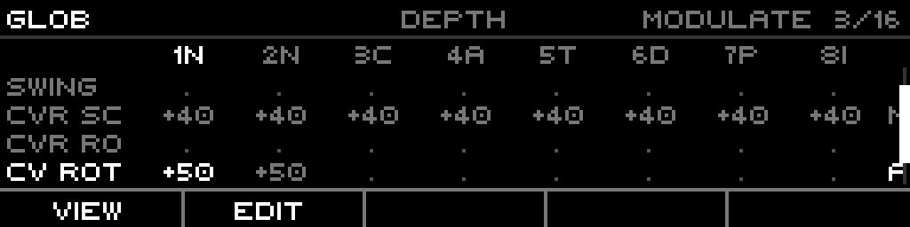
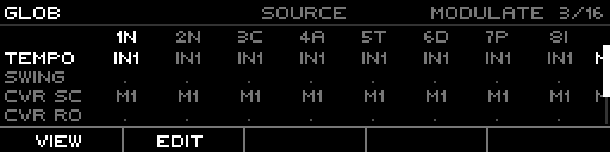
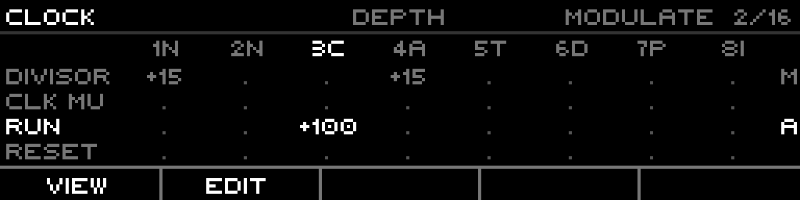
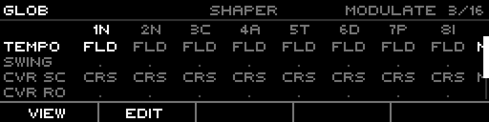
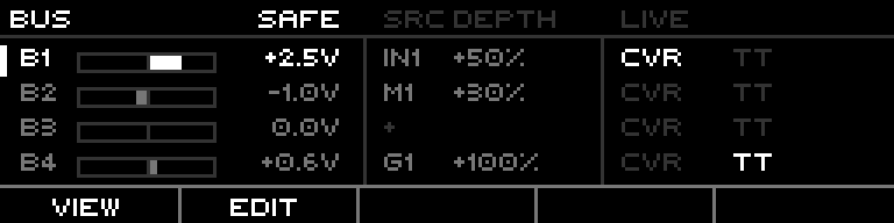

# Routing Manual

## Introduction

Routing is the **modulation matrix**: it maps a source (a CV input, a bus, a
modulator, another output) onto a target parameter, recomputed every engine
frame. One *route* is one source→target wire with its own depth, bias, shaper,
and combine mode. Up to 16 routes live in a project; the page shows them as a
scrollable grid of params × tracks, plus dedicated BUS and MIDI tabs.

A route does not replace a parameter's value — it **shapes** the live source and
adds the result on top of the edited base. The source runs through Bias, Depth,
and an optional Shaper before it lands. Two combine modes decide whether the
source modulates around the base (centered, bipolar) or sweeps the base from one
end of the param's range to the other.

This manual is grounded in the firmware as built. Defaults, ranges, enum
members, key bindings, and target families are taken from the model, engine, and
UI code.

## Prerequisites

Before working with routing you should have:

- Familiarity with the xformer track/sequence/edit page model (Page+S2 / Page+S1 / Page+S0).
- Understanding of CV/gate concepts in modular synthesis (1V/oct, ±5V).
- At least one parameter you want to modulate, and one source (a CV input, modulator, bus, or output) to drive it.

---

# Part 1: Overview

## What a route is

A route holds:

- **Target** — what it drives (a param family member, see Part 2).
- **Source** — what drives it (CV In, CV Out, Bus, Gate Out, Mod, MIDI).
- **Tracks** — for per-track targets, the bitmask of tracks the route applies to.
- **Min / Max** — the param-value window the source spans.
- **Depth** (per track, −100..+100%) — how hard the shaped source pushes.
- **Bias** (per track, −75..+75%) — offsets the source before depth.
- **Shaper** (per track) — an optional waveshape on the source.
- **Combine** — Modulate (centered) or Absolute (sweep from base).
- **Scale source** — a second source that dynamically scales the depth.

The same target can appear in only one active route at a time (per track for
per-track targets); the page guards against duplicate-target conflicts.

## The two scopes of target

- **Global targets** have no track dimension — Tempo, Swing, the CV-router controls, the four buses. One value, one route.
- **Per-track targets** carry an 8-bit track mask. Run, Reset, Transpose, Divisor, the engine params — each route can drive several tracks at once, with an independent depth per track.

## Where routes live

All 16 routes live on the **project**, not on any track. A route survives pattern
and track changes. The routed value is recomputed every frame from the live
source and written as a transient override; the edited base value is never
overwritten.

---

# Part 2: Targets

A target is the parameter a route drives. They group into families. Each family
member has a value range and a default route window (`min..max`). The table
below lists the families with their full value ranges (from the firmware's
target-info table).

## Engine / transport

| Target | Range | Notes |
|---|---|---|
| Play | off/on | start playback |
| Play Toggle | off/on | toggle play (conflicts with Play) |
| Record | off/on | arm record |
| Record Toggle | off/on | toggle record (conflicts with Record) |
| Tap Tempo | off/on | tap |

## Project (global)

| Target | Range | Default window |
|---|---|---|
| Tempo | 1..1000 BPM | 100..200 |
| Swing | 50..75% | 50..75 |
| CVR Scan | 0..100% | 0..100 |
| CVR Route | 0..100% | 0..100 |

## Play-state (per track)

| Target | Range |
|---|---|
| Mute | off/on |
| Fill | off/on |
| Fill Amount | 0..100% |
| Pattern | 1..16 |

## Track (per track)

| Target | Range | Default window |
|---|---|---|
| Run | off/on | — |
| Reset | off/on | — |
| Slide Time | 0..100% | 0..100 |
| Octave | −10..+10 | −1..+1 |
| Transpose | −60..+60 | −12..+12 |
| Offset | −5.00..+5.00V | −1.00..+1.00V |
| Rotate | −64..+64 | 0..64 |
| Gate P. Bias | −8..+8 | full |
| Retrig P. Bias | −8..+8 | full |
| Length Bias | −8..+8 | full |
| Note P. Bias | −8..+8 | full |
| Shape P. Bias | −8..+8 | full |
| CV Out Rot | −8..+8 | 0..8 |
| Gate Out Rot | −8..+8 | 0..8 |

## Sequence (per track)

| Target | Range | Default window |
|---|---|---|
| First Step | 1..64 | full |
| Last Step | 1..64 | full |
| Run Mode | 0..5 (Fwd..Random) | full |
| Divisor | 1..768 | 6..24 |
| Clock Mult | 50..150% | full |
| Phase | 0..1 | — |
| Scale | 0..MaxCount | full |
| Root Note | 0..11 | full |

## Bus (global)

| Target | Range |
|---|---|
| BUS 1 | −5.00..+5.00V |
| BUS 2 | −5.00..+5.00V |
| BUS 3 | −5.00..+5.00V |
| BUS 4 | −5.00..+5.00V |

The buses are engine-owned ±5V CV rails. A route can write a bus; another
route can read that same bus as a source — that is how routing chains across
the matrix.

## Engine families (per track)

Each track engine exposes its own routable params. The routing page surfaces
them on dedicated engine tabs (NOTE / PHASEFLUX / CURVE / TUESDAY / DISCMAP /
INDEXED / STOCH / FRACTAL):

- **Tuesday** — Algorithm, Flow, Ornament, Power, Glide, Trill, StepTrill, Gate Offset, Gate Length.
- **Chaos / Wavefolder** — Chaos Amount/Rate/P1/P2; Fold, Fold Gain, DJ Filter, Curve Rate.
- **DiscreteMap** — DMap Input, Scan, Sync, Above, Below.
- **Indexed** — Indexed A, Indexed B (base-less inlets: a new route defaults to full depth, since depth-0 would be silent).
- **Stochastic** — Mask, Gate Length, Tilt, Feel, Burst, Complexity, Contour, Note Duration, Variation, Rest, Slide, Sleep, Patience R, Mutate, Jump, Range, Bias, Spread, Burst Count, Burst Rate.
- **Fractal** — Branch Count, Path, Orn Rate, Orn Intens, Record Arm.

> **Conflicts are guarded.** Two routes can't drive the same target (same track,
> for per-track targets). Play/Play-Toggle and Record/Record-Toggle are mutually
> exclusive. The editor refuses the second.

---

# Part 3: Sources

A source is what drives the route. The source picker offers every member of the
source enum in order, skipping only the bus that would self-route the target.

## The source families

| Family | Members | Abbrev | Reads |
|---|---|---|---|
| CV In | 1-4 | IN1-4 | the panel CV inputs, raw volts (1V/oct) |
| CV Out | 1-8 | O1-8 | the eight CV outputs, post-engine |
| Bus | 1-4 | B1-4 | the four ±5V engine buses |
| MIDI | — | — | a configured MIDI event (see Part 6) |
| Gate Out | 1-8 | G1-8 | the eight gate outputs (0/1) |
| Mod | 1-8 | M1-8 | the eight modulators, 0..127 mapped to ±5V |

`None` is a valid source — a route with no source is inert until you pick one.

> **Self-route is blocked.** A bus source feeding the same bus target is refused;
> the encoder skips over it, and setting it directly snaps the source to None.

## CV source range

A CV-In source carries a voltage range (default Bipolar ±5V). It sets how the raw
input voltage normalizes into the route's 0..1 working value.

---

# Part 4: The value pipeline — Bias, Depth, Shaper, Combine

This is the system the README cites: a route does not just copy a source onto a
param. It runs the source through a fixed pipeline.

## The stages

1. **Normalize** — the raw source becomes a 0..1 working value (a CV input uses its voltage range; a Mod scales 0..127 → 0..1).
2. **Bias** (−75..+75%) — offsets the working value before depth. Re-centers an asymmetric source.
3. **Shaper** — an optional waveshape. On the routing lane the live shapers are the stateless folds:

| Token | Shaper |
|---|---|
| FLD | Triangle fold (center 0.5) |
| F30 | Triangle fold, center 0.3 |
| F70 | Triangle fold, center 0.7 |
| CRS | Crease (threshold 0.5) |
| C10 | Crease, threshold 0.1 |
| C90 | Crease, threshold 0.9 |

4. **Scale source** — an optional second source multiplies the depth dynamically (None = identity gain of 1.0).
5. **Depth** (−100..+100%) — how far the shaped source travels. Negative inverts.
6. **Combine** — how the result lands on the param.

## Modulate vs Absolute

The combine mode is the headline of how a route feels:

- **Modulate** (default) — the source is centered: a half-scale source produces zero change, full produces ±depth around the base. Neutral at source-center, bipolar. The base value still matters; the route wiggles around it.
- **Absolute** — the source sweeps from the base: source 0 leaves the base untouched, source 1 pushes a full depth×range travel in one direction. The base is the floor; the source pulls it up.

Depth is the modulation amount for Modulate, and the travel span for Absolute.
Routing depth scales to the destination's value range — +50% on Transpose is a
larger pitch swing than +50% on Octave because the ranges differ.

---

# Part 5: The Routing page (Page+Routing)

The routing page is a modal tab editor. A static tab ring runs across the top;
Left/Right cycle the tabs. Each tab is a scrollable grid: param rows × 8 track
columns. The grid cell shows, per the active view, the row's source, depth,
scale, or shaper for that track.

## The tabs

The tab ring, in order: **PITCH · CLOCK · GLOB · NOTE · PHASEFLUX · CURVE ·
TUESDAY · DISCMAP · INDEXED · STOCH · FRACTAL · BUS · MIDI**.

The first three (PITCH, CLOCK, GLOB) are cross-engine *bands* — they collect
shared pitch/clock/global params. The engine tabs list that engine's own params.
BUS and MIDI are dedicated detail views.

## The grid

- **Header** — tab name (left, bright), the centered view tag (SOURCE / DEPTH / SCALE / SHAPER, dim), the combine state (MODULATE / ABSOLUTE) and the occupied-slot counter `n/16` (right). The counter goes bright when all 16 routes are used.
- **Column headers** — track number + engine letter (`1N`, `2C`, …). The cursor column is bright; columns whose engine doesn't own the cursor row's param are dim.
- **Rows** — the param name in the left gutter (38px for bands, 52px for engine tabs), then 8 cells. A cell reads `-` (ineligible for that engine), `.` (eligible, unrouted), or a value (routed). The right margin carries a per-row `M`/`A` combine marker.
- **Scrollbar** — right edge, when the param list overflows the 4 visible rows.

## The four cell views (F1 VIEW cycles)

F1 walks the cell view: **SOURCE → DEPTH → SCALE → SHAPER → SOURCE**. The view
changes what the eligible cells print:

| View | Cell shows |
|---|---|
| SOURCE | the route's single source abbrev (one source per row) |
| DEPTH | per-track depth `+nn` (membership: non-zero depth = member) |
| SCALE | the route's scale-source abbrev (`.` = no scale gain) |
| SHAPER | the route's shaper token (FLD/CRS/…) |

<figure>
  
  <figcaption>GLOB band, DEPTH view. Per-track depth values; CV Rot routed +50 on tracks 1-2 (ABSOLUTE, "A" marker); slot counter 3/16. Mirrors RoutingPage::drawTabEditor.</figcaption>
</figure>

<figure>
  
  <figcaption>Same band, SOURCE view (F1). Each routed row paints its single source on every eligible cell — Tempo←IN1, CVR Scan←M1. Mirrors the MatrixView::Source branch of drawTabEditor.</figcaption>
</figure>

<figure>
  
  <figcaption>CLOCK band, DEPTH view, cursor on track 3. Divisor routed +15 on tracks 1+4; Run routed +100 (ABSOLUTE) on track 3. Mirrors drawTabEditor with Run/Reset folded into the band.</figcaption>
</figure>

<figure>
  
  <figcaption>SHAPER view. Routed rows show their shaper token (FLD = triangle fold, CRS = crease). Mirrors the MatrixView::Shaper branch.</figcaption>
</figure>

## Editing a route (F2 EDIT)

F2 toggles nav ↔ edit on the cursor row. On an unrouted row it creates a fresh
inert draft (source None, depth 0) and opens on SOURCE; on a routed row it copies
the live route into a draft. **The live route is untouched until COMMIT** — the
draft is what the grid renders and edits.

While editing:

- **Encoder** dials the focused field (SOURCE: source family; DEPTH: the cursor cell's depth; SCALE/SHAPER: that lane's value). Shift+encoder jumps whole source families.
- **F1 VIEW** — cycle the cell view.
- **F3 MOD/ABS** — toggle Modulate ↔ Absolute on the draft.
- **F4 CANCEL** — discard the draft (Shift+CANCEL on a routed row removes the committed route entirely).
- **F5 COMMIT** — write the draft live (only when the draft is valid).
- **T1-T8** — move the cursor to that track's column. Shift+Tn spreads the cursor cell's depth to every eligible track sharing track n's engine.

## LEDs

The routing page is modal and draws no step-grid LEDs of its own; the function
row reflects the footer state (EDIT highlighted while editing).

---

# Part 6: The BUS and MIDI tabs

## BUS tab

The BUS tab is a per-lane detail view of the four ±5V buses. Each lane shows its
live voltage as a bipolar bar, the one routing source feeding it with depth, and
two activity lights — **CVR** (the CV-router is writing this lane this frame) and
**TT** (Teletype is). A **SAFE** indicator marks bus-safety on.

F2 EDIT opens the focused lane's route (or creates one); the encoder picks the
source and depth; F3 toggles MOD/ABS (Shift+F3 toggles SAFE); F5 commits.

<figure>
  
  <figcaption>BUS tab, lane B1 focused. Live volts bars + values, the routing source/depth feeding each lane (B1←IN1 +50%, B2←M1 +30%, B3 empty "+", B4←G1 +100%), CVR/TT lights, SAFE on. Mirrors RoutingPage::drawBus.</figcaption>
</figure>

## MIDI tab

The MIDI tab lists every route whose source is MIDI, one row each, with the
target it drives, Port, Channel, Event, and CC/Note. The MIDI event kinds are CC
Absolute, CC Relative, Pitch Bend, Note Momentary, Note Toggle, Note Velocity,
Note Range. F2 EDIT opens the focused route; F1 walks the columns; F3 arms LEARN
(capture the next incoming MIDI into the draft); F5 commits.

---

# Part 7: Set up a route from the Note track page

This is the in-context workflow: add a route to a parameter without leaving the
edit page, then dial it. The example modulates **Transpose** on a NoteTrack from
**CV In 1**, so an external CV transposes the sequence in real time.

<ol class="steps">
<li><strong>Open the Note track param list.</strong> Hold Page and press S2 (Track). The Note track page (a ListPage) shows the track-wide params: Slide Time, Octave, Transpose, Rotate, the bias params. (Per-sequence params like Divisor/Scale live on Page+S1; either page hosts the same MOD+ flow.)</li>

<li><strong>Focus a routable param.</strong> Turn the encoder (or Left/Right) to land the cursor on <strong>Transpose</strong>. On the Note track page the MOD+-routable rows are Slide Time, Octave, Transpose, Rotate, and the four probability biases — these are the params whose <code>routingTarget</code> is non-None.</li>

<li><strong>Open the context menu and add the route.</strong> Long-press the encoder to open the page context menu. On an unrouted param it reads <strong>INIT · COPY · PASTE · DUPL · MOD+</strong>. Select <strong>MOD+</strong>. This creates a new route for Transpose on the selected track and drops you straight into edit, focused on the source.</li>

<li><strong>Pick the source.</strong> The row is now in edit with the source focused. Turn the encoder to cycle the source: stop on <strong>CV In 1</strong> (shows as <code>IN1</code>). Shift+encoder jumps by source family (CvIn → CvOut → Bus → GateOut → Mod) if you need to skip ahead.</li>

<li><strong>Set depth and combine.</strong> Press the encoder to leave source focus and move to depth. Turn it to set the depth, e.g. <strong>+50%</strong> — on Transpose (range −60..+60) that is a wide pitch swing. Press F3 to flip <strong>MOD</strong> (centered: CV around the base transpose) vs <strong>ABS</strong> (sweep: CV pulls the base up by depth×range).</li>

<li><strong>Commit and hear it.</strong> Press F5 COMMIT to write the route live. Now feed a CV into input 1 and the sequence transposes with it. The Transpose row keeps showing the live routed value; the edited base is unchanged underneath. To remove the route later, long-press → the menu now reads <strong>MOD-</strong>.</li>
</ol>

> **MOD- removes only this track.** On a per-track target, MOD- drops the
> selected track from the route's mask; the route survives if other tracks still
> use it.

---

# Part 8: Reference

## Route capacity

A project holds **16 routes** (`CONFIG_ROUTE_COUNT`). The slot counter `n/16` in
the page header tracks occupancy; at 16 it goes bright and EDIT on an empty row
reports `NO EMPTY ROUTES`.

## Per-route fields

| Field | Range | Default |
|---|---|---|
| Depth (per track) | −100..+100% | +100 |
| Bias (per track) | −75..+75% | 0 |
| Shaper (per track) | None / fold / crease | None |
| Min / Max | 0..1 normalized (shown in target units) | target's default window |
| Combine | Modulate / Absolute | Modulate |
| Scale source | any source except self | None |

## Inlet targets

DMap Input, DMap Scan, Indexed A, and Indexed B are **base-less inlets** — their
getter reads the routed value from base 0, so a depth-0 route would be silent. A
new route onto an inlet defaults to **full depth** instead of 0.
</content>
</invoke>
